<div align="center">

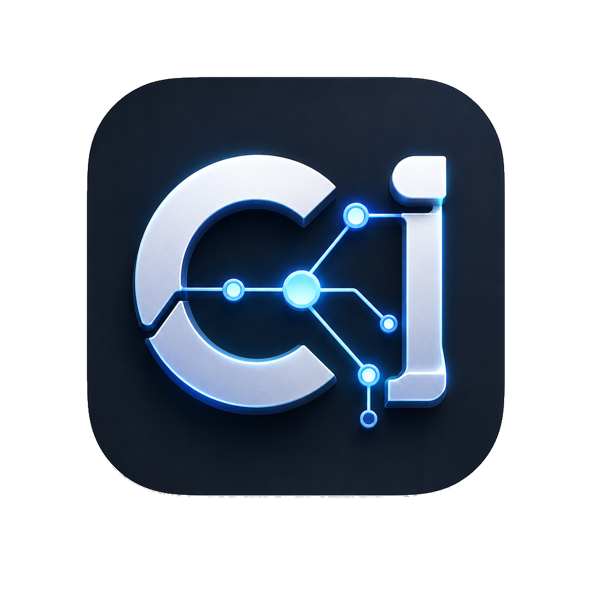

<h1>CodeInsights</h1>

**[English](./README_en.md)** | **[中文](./README.md)**

</div>

CodeInsights 是一个本地优先的 AI Agent 桌面工作台，面向开源软件贡献、代码协作和长期任务自动化。它把成熟 coding agent 运行时接入到可审计、可回退、可验证的工程流程中，让复杂贡献从“一次性聊天”变成有阶段、有证据、有回放的工程协作。

<div align="center">

*Pipeline | Agent · 本地优先 · 可审计 · 可回放 · 人工 Gate · 多运行时接入*

[](#pipeline-工作流) [](#agent-runtime) [](#pipeline-工作流) [](#本地数据与配置) [](#agent-runtime) [](#整体架构) [](#贡献说明)

---

<video src="https://github.com/user-attachments/assets/64ca3efd-b424-4e09-b0ca-9c4840cf9588" controls width="900" autoplay muted loop></video>

[项目主页](https://zcxggmu.github.io/CodeInsights/)

[产品优势](#产品优势) · [真实界面](#真实界面预览) · [功能演示](#功能演示视频) · [核心定位](#核心定位) · [核心能力](#核心能力) · [快速开始](#快速开始) · [架构](#整体架构) · [Pipeline](#pipeline-工作流) · [Agent Runtime](#agent-runtime) · [本地数据](#本地数据与配置) · [开发指南](#开发指南) · [常用命令](#常用命令) · [安全边界](#安全与边界) · [素材](#素材目录) · [贡献](#贡献说明)

</div>

---

<a id="产品优势"></a>

## ✨ 产品优势

<table>
<tr>
<td width="33%" valign="top">

### 可审计流水线

`Pipeline` 把开源贡献拆成 Explorer、Planner、Developer、Reviewer、Tester、Committer 六个节点。每个阶段都有明确产物、人工 gate 和验证证据，方便继续、重跑、回退或接受风险。

</td>
<td width="33%" valign="top">

### 本地优先工作台

配置、会话索引、JSONL 事件、checkpoint、artifacts 和工作区文件默认保存在本机。CodeInsights 不依赖本地数据库，便于迁移、排障、审计和开源协作。

</td>
<td width="34%" valign="top">

### 复用成熟运行时

`Agent` 模式接入 Claude Agent SDK 兼容链路，Pipeline 的开发、审查、测试和提交材料阶段可走 Codex SDK / CLI。CodeInsights 专注于工作流、权限、状态、桥接和本地存储。

</td>
</tr>
</table>

---

<a id="真实界面预览"></a>

## 真实界面预览

以下素材来自真实 Electron 开发窗口，采集时使用隔离配置目录，避免读取本机已有渠道、会话和凭证。录屏与截图展示的是不依赖真实 API Key 的可见工作台状态。

<table>
<tr>
<td width="50%" valign="top">

### Pipeline 工作台

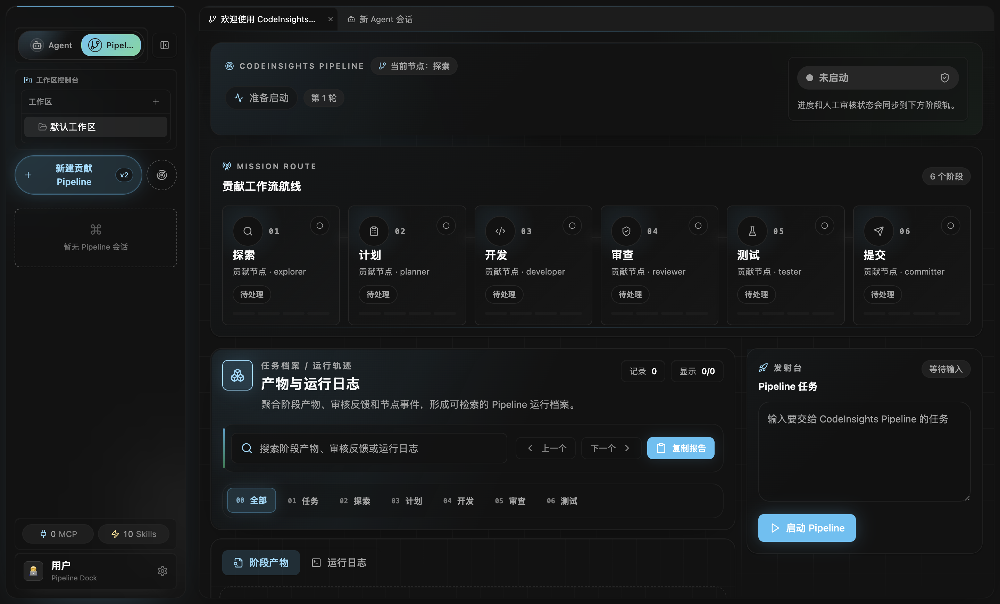

六阶段贡献流水线、Mission Route、人工 gate、产物和运行日志在同一工作台中集中展示。

</td>
<td width="50%" valign="top">

### Agent 工作区

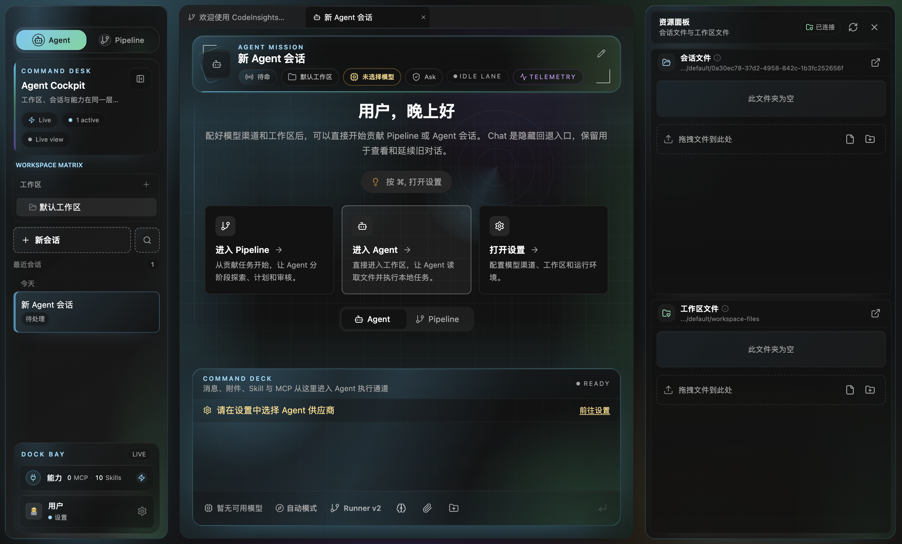

Agent 会话、Command Deck、工作区文件、资源面板和任务上下文保持在同一个本地桌面流程里。

</td>
</tr>
<tr>
<td width="50%" valign="top">

### 模型配置

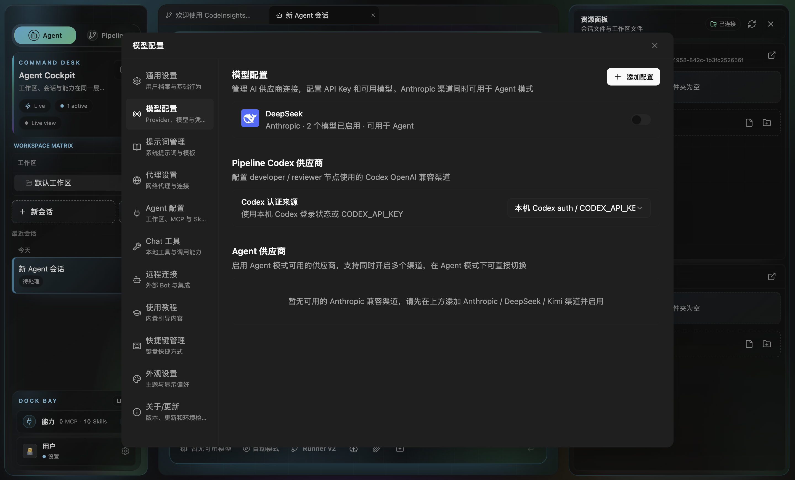

多 Provider 渠道、DeepSeek 预设、Pipeline Codex 认证来源和 Agent 供应商设置集中在设置面板中。

</td>
<td width="50%" valign="top">

### Agent 设置 / MCP / Skills

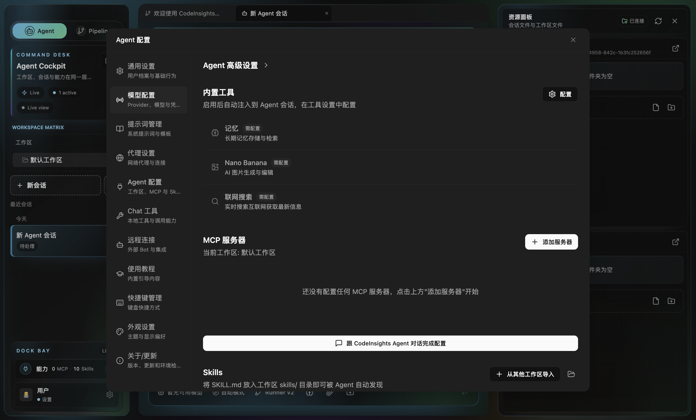

Agent 高级设置、内置工具、MCP Server 和 Skills 按工作区隔离管理，方便扩展本地自动化能力。

</td>
</tr>
</table>

---

<a id="功能演示视频"></a>

## 功能演示视频

以下短视频来自真实 Electron 开发窗口，采集时同样使用隔离配置目录。演示只覆盖本地可验证的 UI 流程，不调用真实模型、不连接飞书/钉钉/微信 Bridge，也不读取本机历史会话或密钥。

GitHub README 对仓库内相对路径 MP4 的内嵌播放支持不稳定，因此这里使用预览图链接到仓库内 MP4；如需像首屏总览一样直接内嵌播放，需要把对应视频上传为 GitHub `user-attachments` 后替换为附件 URL。

<table>
<tr>
<td width="50%" valign="top">

### Pipeline 工作流

<a href="./docs/assets/readme/real-runs/feature-01-pipeline-workflow.mp4">
  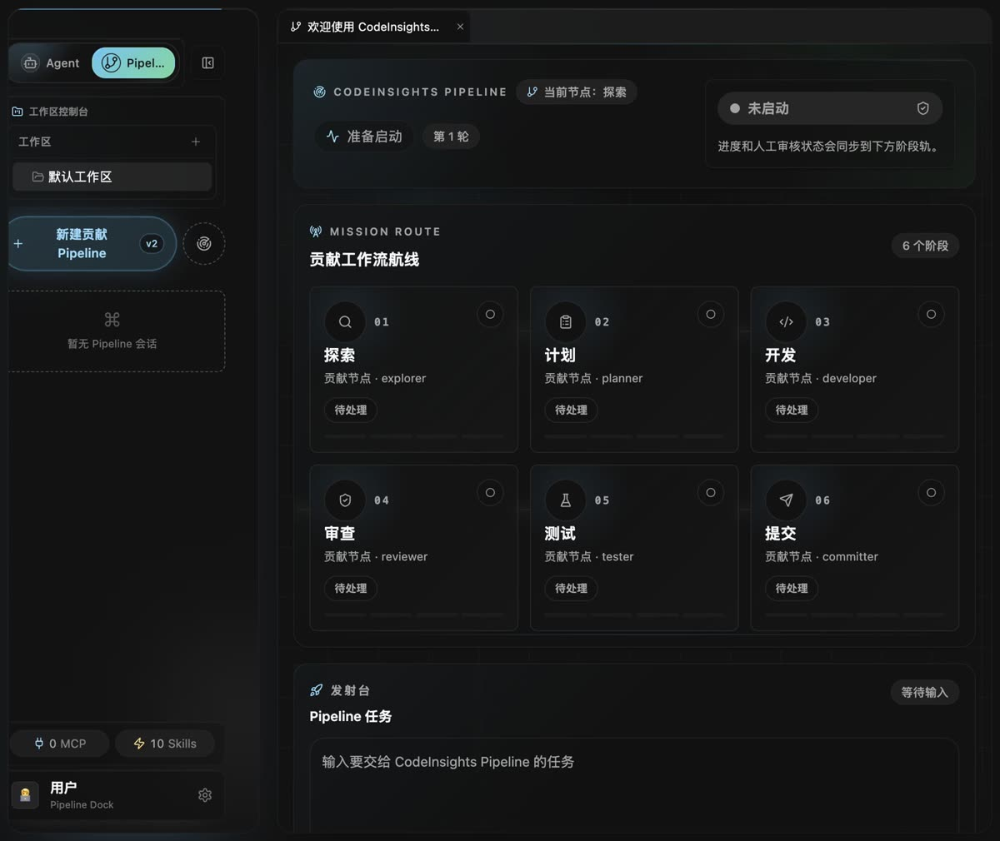
</a>

[打开演示视频](./docs/assets/readme/real-runs/feature-01-pipeline-workflow.mp4)

展示 Pipeline 工作台、六阶段 Mission Route、记录过滤，以及阶段产物 / 运行日志切换。

</td>
<td width="50%" valign="top">

### Agent 工作区

<a href="./docs/assets/readme/real-runs/feature-02-agent-workspace.mp4">
  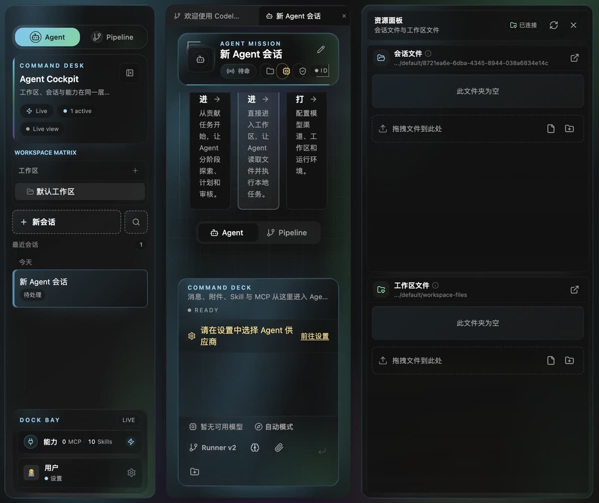
</a>

[打开演示视频](./docs/assets/readme/real-runs/feature-02-agent-workspace.mp4)

展示 Agent 模式、工作区矩阵、新会话入口、右侧资源面板和能力入口。

</td>
</tr>
<tr>
<td width="50%" valign="top">

### 模型与 Provider 配置

<a href="./docs/assets/readme/real-runs/feature-03-provider-settings.mp4">
  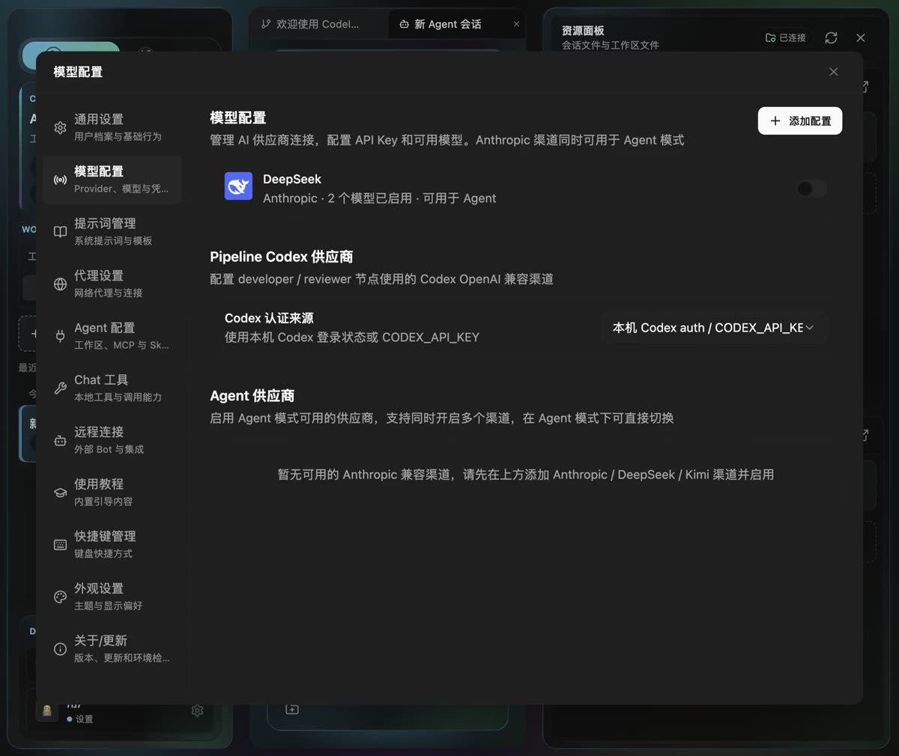
</a>

[打开演示视频](./docs/assets/readme/real-runs/feature-03-provider-settings.mp4)

展示模型配置页、DeepSeek 预设、Pipeline Codex 认证来源和新增 Provider 配置表单。

</td>
<td width="50%" valign="top">

### Agent MCP / Skills 配置

<a href="./docs/assets/readme/real-runs/feature-04-agent-mcp-skills.mp4">
  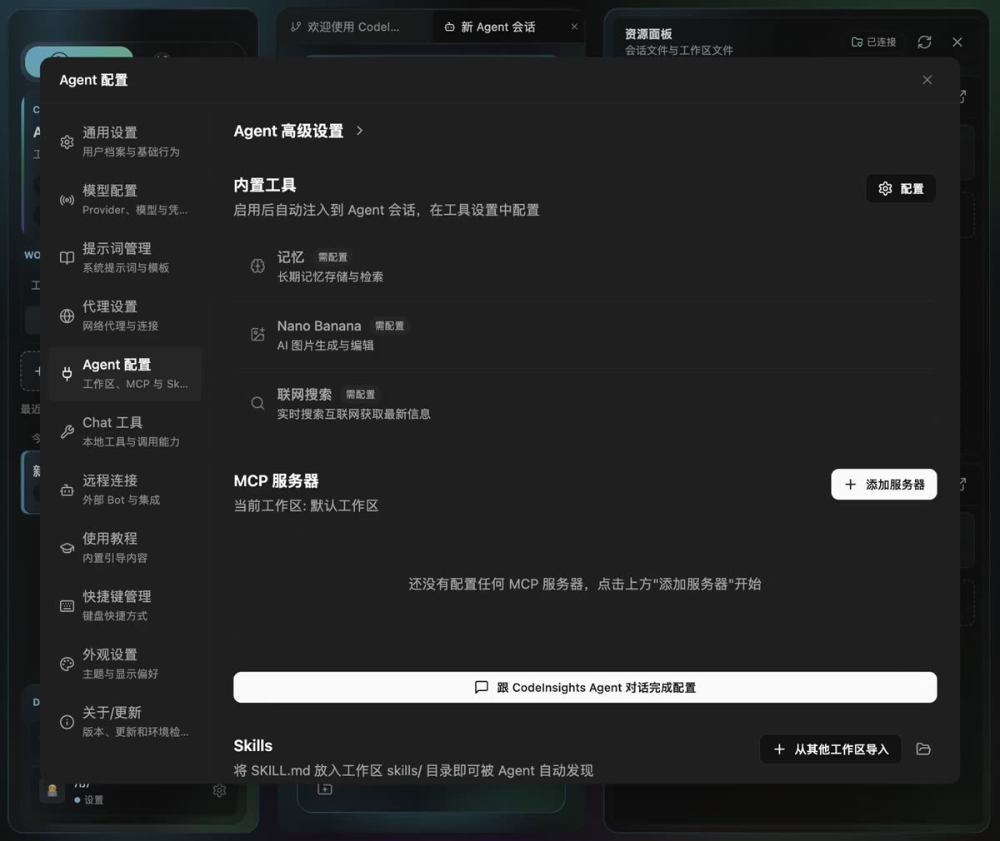
</a>

[打开演示视频](./docs/assets/readme/real-runs/feature-04-agent-mcp-skills.mp4)

展示 Agent 高级设置、内置工具、MCP Server、Skills 列表和工作区隔离能力。

</td>
</tr>
</table>

---

## 核心定位

CodeInsights 的产品假设很直接：

1. 通用 Agent 很强，但长期软件贡献需要工程化流程，而不是一次性聊天。
2. 复杂任务需要阶段化产物、人工 gate、验证证据和恢复能力。
3. 本地配置、会话记录、checkpoint、workspace 文件和 artifacts 应优先保存在用户机器上，便于审计和迁移。
4. AI 运行时不必全部重写。CodeInsights 负责工作流、状态、权限、桥接和本地存储，底层执行复用 Claude Agent SDK、OpenAI Codex SDK / CLI 等成熟运行时。

适合的使用场景：

- 给开源仓库寻找贡献点，规划方案，执行实现，审查和验证。
- 在本地工作区中让 Agent 读取文件、修改代码、运行命令、整理资料。
- 用飞书、钉钉、微信 Bridge 从远程消息触发桌面 Agent。
- 把 MCP Server、Skills、工作区文件和本地 JSON / JSONL 记录组合成可复用工作流。

## 核心能力

| 能力 | 当前状态 | 说明 |
|------|----------|------|
| Pipeline v2 | 已接入 | 默认新建贡献流水线，包含 Explorer / Planner / Developer / Reviewer / Tester / Committer 和多类人工 gate |
| Agent 模式 | 已接入 | 基于 Claude Agent SDK，支持 Anthropic / DeepSeek / Kimi API / Kimi Coding 等 Anthropic 协议兼容渠道 |
| Codex 节点 | 已接入 | Pipeline 的开发、审查、测试和提交材料阶段可走 OpenAI Codex SDK，支持 CLI fallback |
| 本地优先存储 | 已接入 | 会话索引、JSONL 事件、Pipeline checkpoint、artifacts、工作区文件均落本地文件系统 |
| 多 Provider 渠道 | 已接入 | Anthropic、OpenAI、DeepSeek、Google、Moonshot / Kimi、智谱、MiniMax、豆包、通义千问、自定义 OpenAI 兼容端点 |
| MCP / Skills | 已接入 | 按 Agent 工作区隔离 MCP 配置、启用 Skills、禁用 Skills 和工作区文件 |
| IM Bridge | 已接入 | 飞书、钉钉、微信 Bridge 通过主进程服务连接 Agent / Chat 会话 |
| 权限与人工交互 | 已接入 | 工具权限、AskUser、ExitPlan、Pipeline gate 均按 session 隔离，后台会话不丢事件 |
| 自动更新与环境检查 | 已接入 | Electron Updater、运行时检查、系统代理、Bun / Git / Node / WSL 检测 |
| 旧 Chat 回退 | 保留 | Provider 适配、附件、文档解析、工具调用等历史能力仍存在，但不是主入口 |

## 快速开始

### 环境要求

- Bun `1.2.5+`
- Git
- macOS / Windows / Linux

项目使用 Bun workspace。请优先使用 `bun install` 和 `bun run`，不要混用 npm / pnpm / yarn 安装依赖。

### 从源码运行

```bash
git clone https://github.com/zcxGGmu/CodeInsights.git
cd CodeInsights

bun install
bun run dev
```

`bun run dev` 会启动 Vite renderer、构建 Electron main / preload，并通过 electronmon 运行桌面应用。开发模式默认使用 `~/.codeinsights-dev/`，不会污染正式版本的 `~/.codeinsights/`。

### 构建后启动

```bash
bun run electron:build
bun run electron:start
```

### 常用命令

| 命令 | 说明 |
|------|------|
| `bun run dev` | 启动 Electron 开发模式 |
| `bun run electron:dev` | `bun run dev` 的别名 |
| `bun run electron:build` | 构建 main、preload、file preview preload、renderer 和 resources |
| `bun run electron:start` | 构建后启动 Electron |
| `bun run build` | 构建 workspace 中声明 build 脚本的包 |
| `bun run typecheck` | 对 workspace 包执行 TypeScript 检查 |
| `bun test` | 运行 Bun 测试 |

Electron 子包内的常用命令：

```bash
cd apps/electron

bun run dev:vite
bun run dev:electron
bun run build:main
bun run build:preload
bun run build:preview-preload
bun run build:renderer
bun run dist:fast
```

### 首次配置建议

1. 在设置中创建一个 Agent 兼容渠道：`anthropic`、`deepseek`、`kimi-api` 或 `kimi-coding`。
2. 创建或选择 Agent 工作区，配置 MCP Server、Skills 和工作区文件。
3. 如需使用 Pipeline v2 的 Codex 节点，在渠道设置里选择 OpenAI / Custom 作为 Pipeline Codex 渠道；也可以使用本机 Codex 登录或 `CODEX_API_KEY`。
4. 启动 Pipeline 任务前检查 preflight 提示，确保 Agent 渠道、工作区和 Codex 运行时都可用。

## 技术栈

| 层级 | 技术 |
|------|------|
| 运行时 / 包管理 | Bun `1.2.5+` |
| 语言 | TypeScript `5+` |
| 桌面框架 | Electron `39.5.1` |
| 前端框架 | React `18.3.1` |
| 状态管理 | Jotai `2.17.1` |
| 样式与组件 | Tailwind CSS `3.4.17`、Radix UI、lucide-react |
| Renderer 构建 | Vite `6.0.3` |
| Main / Preload 构建 | esbuild `0.24+` |
| Agent Runtime | `@anthropic-ai/claude-agent-sdk@0.2.123` |
| Pipeline 编排 | `@langchain/langgraph@1.3.0` |
| Codex 执行 | `@openai/codex-sdk@0.130.0`、`@openai/codex@0.130.0` |
| 代码高亮 | Shiki `3.22.0` |
| 富文本输入 | TipTap `3.19.0` |
| Markdown / 数学公式 | React Markdown、remark-gfm、KaTeX |
| 打包分发 | electron-builder `25.1.8` |

## Monorepo 结构

```text
CodeInsights/
├── packages/
│   ├── shared/          # 共享类型、IPC 通道常量、配置、工具函数
│   ├── core/            # Provider 适配器、SSE reader、Shiki 高亮
│   └── ui/              # 共享 React UI 组件
├── apps/
│   └── electron/        # Electron 桌面应用
│       ├── default-skills/
│       ├── resources/
│       ├── scripts/
│       └── src/
│           ├── main/        # 主进程、IPC、服务层
│           ├── preload/     # contextBridge API
│           └── renderer/    # React UI
├── assets/              # README / 官网 / 视频使用的品牌和架构素材
├── docs/                # 架构、Pipeline、产品和历史设计文档
├── tasks/               # 当前任务计划与经验记录
├── tutorial/            # 内置教程内容
├── web/                 # 静态产品主页
└── web-console/         # Web Console 相关目录
```

当前 workspace 包：

| 包 | 当前版本 | 职责 |
|----|----------|------|
| 根包 `codeinsights` | `0.1.1` | Bun workspace 根配置 |
| `@codeinsights/shared` | `0.1.42` | 共享类型、IPC 常量、Agent / Pipeline 契约和工具 |
| `@codeinsights/core` | `0.2.12` | Provider 适配器、SSE 读取、thinking 能力识别、Shiki 高亮 |
| `@codeinsights/ui` | `0.1.4` | `CodeBlock`、`MermaidBlock` 等共享 UI |
| `@codeinsights/electron` | `0.0.102` | 完整 Electron 桌面应用 |

内部包依赖方向保持单向：

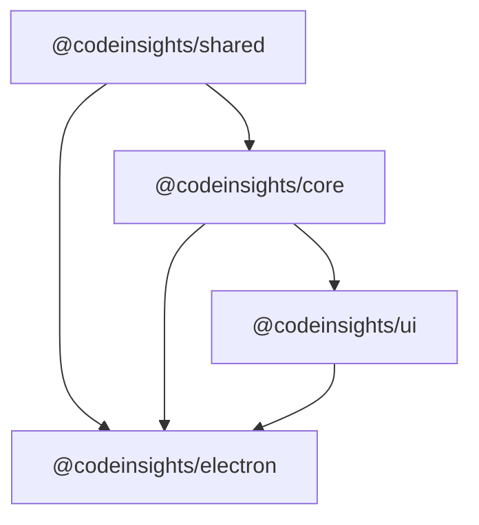
```mermaid
flowchart TD
  shared["@codeinsights/shared"]
  core["@codeinsights/core"]
  ui["@codeinsights/ui"]
  electron["@codeinsights/electron"]

  shared --> core
  shared --> electron
  core --> ui
  core --> electron
  ui --> electron
```

## 整体架构

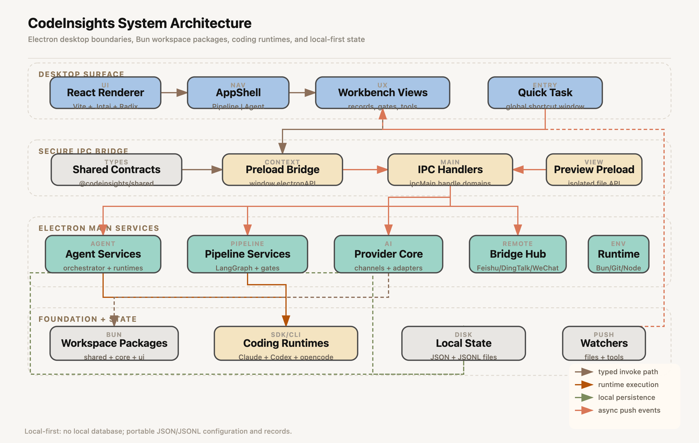

CodeInsights 使用 Electron 三进程边界和本地服务层：

| 层 | 入口 | 职责 |
|----|------|------|
| Main | `apps/electron/src/main/index.ts` | 窗口、托盘、生命周期、运行时初始化、IPC 注册、Agent / Pipeline / Bridge / 更新器 / watcher |
| Preload | `apps/electron/src/preload/index.ts` | `contextBridge.exposeInMainWorld('electronAPI', ...)`，提供安全白名单 API |
| File Preview Preload | `apps/electron/src/preload/file-preview-preload.ts` | 文件预览窗口的隔离 API |
| Renderer | `apps/electron/src/renderer/main.tsx` | React UI、Jotai 状态、全局 IPC listeners、主题、快捷键、通知 |
| Packages | `packages/shared`、`packages/core`、`packages/ui` | 共享契约、Provider 适配和跨应用 UI 能力 |

主进程关键服务集中在 `apps/electron/src/main/lib/`：

| 领域 | 代表文件 | 说明 |
|------|----------|------|
| Agent 编排 | `agent-orchestrator.ts`、`agent-runtime-runner.ts`、`agent-service.ts` | SDK 调用、runner-v2、事件流、并发守卫、权限、持久化、重试 |
| Agent 工作区 | `agent-workspace-manager.ts`、`agent-runtime-materializer.ts`、`agent-runtime-manifest-registry.ts` | 工作区 CRUD、MCP、Skills、runtime snapshot、session cwd |
| Pipeline | `pipeline-service.ts`、`pipeline-graph.ts`、`pipeline-node-router.ts` | LangGraph 编排、start / resume / stop / state、节点路由 |
| Pipeline 执行 | `pipeline-node-runner.ts`、`codex-pipeline-node-runner.ts` | Claude 节点、Codex SDK / CLI 节点、结构化输出解析 |
| Pipeline 产物 | `pipeline-artifact-service.ts`、`pipeline-patch-work-service.ts`、`contribution-task-service.ts` | artifacts、patch-work、贡献任务状态和提交材料 |
| 渠道管理 | `channel-manager.ts` | Provider CRUD、API Key 加密、测试连接、模型拉取 |
| 远程 Bridge | `bridge-registry.ts`、`feishu-*`、`dingtalk-*`、`wechat-*` | 飞书、钉钉、微信连接和命令处理 |
| Chat 回退 | `chat-service.ts`、`conversation-manager.ts`、`chat-tools/*` | 历史 Chat、工具调用、消息持久化 |
| 文件与文档 | `attachment-service.ts`、`document-parser.ts`、`file-preview-service.ts` | 附件、PDF / Office / 文本解析、文件预览 |
| 系统服务 | `runtime-init.ts`、`bun-finder.ts`、`git-detector.ts`、`node-detector.ts`、`shell-env.ts` | Shell、Bun、Git、Node、WSL 检测 |
| 设置与更新 | `settings-service.ts`、`proxy-settings-service.ts`、`updater/*` | 主题、代理、自动更新、GitHub release |

Renderer 主要模块：

| 目录 | 说明 |
|------|------|
| `atoms/` | Jotai 状态：Pipeline、Agent、Chat、Settings、Theme、Tabs、Bridge、Updater |
| `hooks/` | 全局 IPC listeners、会话创建 / 打开、标签页、后台任务、快捷键 |
| `components/app-shell/` | 三栏布局、模式切换、导航、搜索、右侧面板 |
| `components/pipeline/` | Pipeline 视图、阶段轨道、记录、gate、失败卡片、Committer 面板 |
| `components/agent/` | Agent 消息、工具活动、权限、AskUser、ExitPlan、工作区、任务进度 |
| `components/settings/` | 渠道、Agent、MCP、Skills、Bridge、主题、代理、记忆、快捷键、更新 |
| `components/file-browser/` | 工作区文件树、文件拖放、文件提及 |
| `components/ai-elements/` | Markdown、推理块、富文本输入、文件路径 chip、滚动辅助 |
| `components/quick-task/` | 快速任务窗口 UI |

## Pipeline 工作流

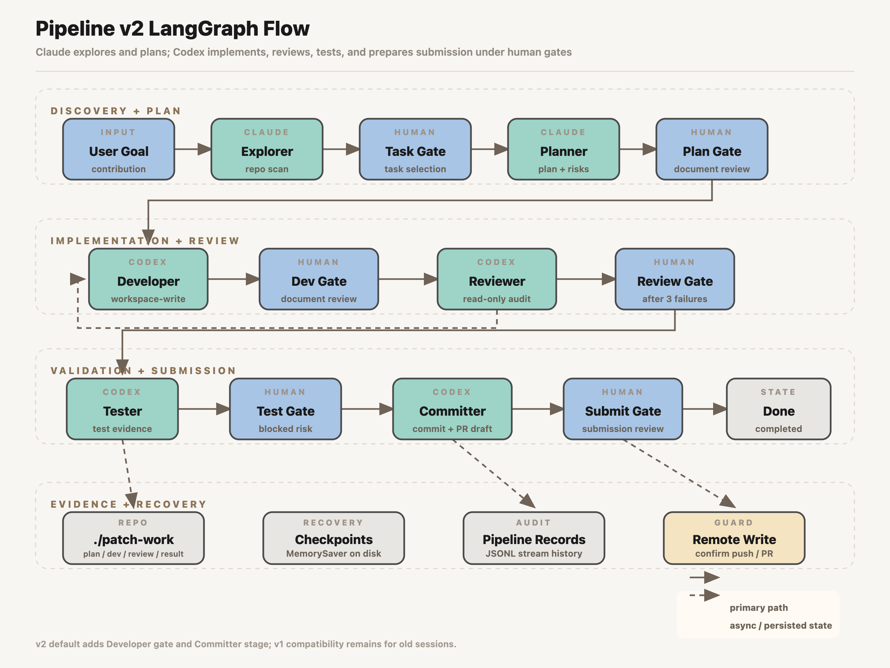

Pipeline v2 是当前新建贡献任务的默认流程。它把开源贡献拆成六个阶段，并在关键位置用人工 gate 控制继续、重跑、返工或接受风险。

### 节点职责

| 节点 | v2 运行时 | 主要职责 | 关键产物 |
|------|-----------|----------|----------|
| Explorer | Claude Agent SDK | 阅读用户目标和仓库上下文，发现可贡献任务，生成候选报告 | `summary`、`findings`、`keyFiles`、`reports` |
| Planner | Claude Agent SDK | 把选定任务转成计划、风险和验证路径 | `plan.md`、`test-plan.md`、`steps`、`risks` |
| Developer | Codex SDK / CLI | 在工作区内实现修改，补充必要测试和开发记录 | `dev.md`、`changedFiles`、`testsRun` |
| Reviewer | Codex SDK / CLI | 只读审查 diff，聚焦正确性、回归、测试缺口、安全和维护性 | `review.md`、`approved`、`structuredIssues` |
| Tester | Codex SDK / CLI | 运行验证命令，收集测试证据和 patch-set 摘要 | `result.md`、`testEvidence`、`patchSet` |
| Committer | Codex SDK / CLI | 生成提交信息、PR 标题和正文草稿，进入提交审核 | `commit.md`、`pr.md`、`submissionStatus` |

Pipeline v1 仍用于旧会话兼容：`explorer / planner / tester` 走 Claude，`developer / reviewer / committer` 走 Codex。v2 默认是：`explorer / planner` 走 Claude，`developer / reviewer / tester / committer` 走 Codex。

### Gate 语义

| Gate | 触发位置 | 作用 |
|------|----------|------|
| `task_selection` | Explorer 后 | 选择或确认贡献任务 |
| `document_review` | Planner / Developer / Reviewer | 审核阶段文档或变更摘要 |
| `review_iteration_limit` | Reviewer 多轮未通过 | 让用户接管是否接受风险或继续返工 |
| `test_blocked` | Tester 失败或证据不足 | 明确测试阻塞项，用户可接受风险或回到开发 |
| `submission_review` | Committer 后 | 审核提交材料草稿 |
| `remote_write_confirmation` | 远端提交前 | 对 push / PR 这类远端写操作做显式确认 |

Gate 是 Pipeline 的一等状态，不是普通聊天消息。`approve` 会继续到下一节点，`rerun_node` 会带反馈重跑当前节点，Reviewer 的 `reject_with_feedback` 会回到 Developer 并递增 `reviewIteration`。

### Codex 执行边界

Pipeline Codex 节点默认使用 `@openai/codex-sdk`，可通过环境变量切换到 CLI fallback：

```bash
CODEINSIGHTS_PIPELINE_CODEX_BACKEND=cli bun run dev
```

Codex 渠道只接受启用的 OpenAI / Custom 渠道。未选择 Pipeline Codex 渠道时，会尝试使用本机 Codex auth 或 `CODEX_API_KEY`。

v2 中 Codex 节点带有 Git 防护：

- Developer 使用 `workspace-write`，Reviewer 使用 `read-only`。
- `git`、`gh`、`hub` 等命令会被 guard 阻断，防止节点私自 commit / push / tag / PR。
- 提交材料由 Committer 生成草稿；实际本地 commit 或远端提交由 Pipeline service 在用户确认后执行。

### 状态恢复

Pipeline 使用 LangGraph `MemorySaver` 的本地落盘 checkpointer。应用重启后：

- `waiting_human` 会话可以恢复 pending gate。
- `running` 会话不会假装继续执行，当前策略是标记为 `recovery_failed`，避免 UI 显示已经丢失的后台任务。
- `getSessionState` 优先读取 checkpoint；失败时回放 JSONL records 作为兜底。

## Agent Runtime

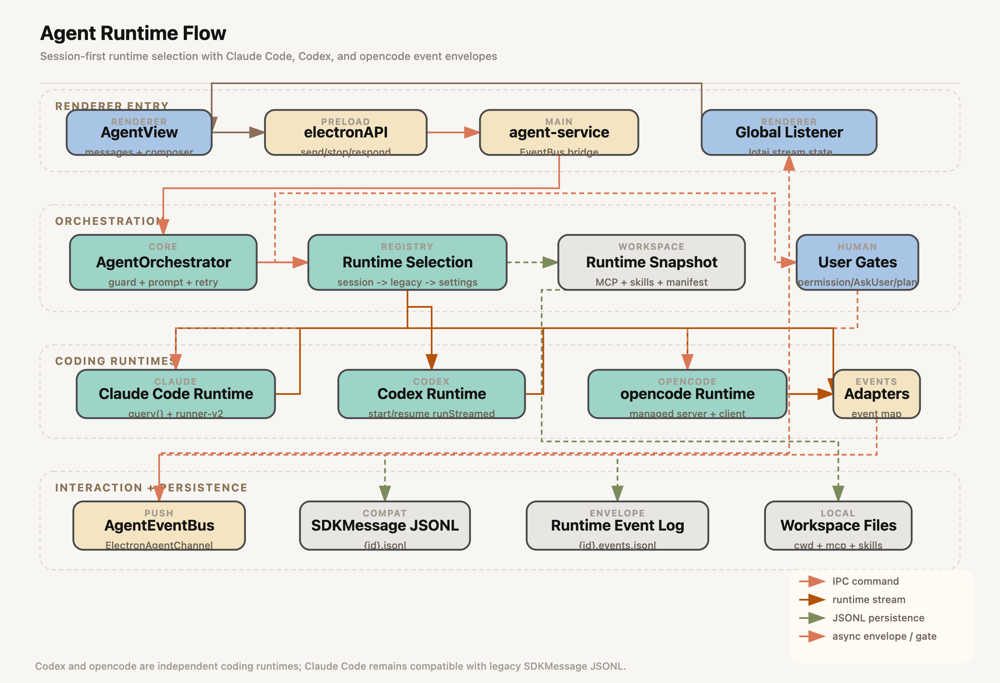

Agent 模式是通用自主执行入口，适合调研、代码修改、文件整理、自动化任务和长上下文协作。

### 运行链路

```text
Renderer AgentView
  -> preload electronAPI
  -> main IPC agent handlers
  -> agent-service
  -> AgentOrchestrator
  -> Agent Runtime Runner
  -> Claude Agent SDK query()
  -> SDKMessage / RuntimeEvent stream
  -> JSONL 持久化 + Renderer 全局监听器
```

关键能力：

- 同一 session 有并发守卫，避免两个请求同时写同一会话。
- runner-v2 默认启用，输出 `AgentRuntimeEvent`，同时保留旧 SDKMessage JSONL。
- 权限请求、AskUser、ExitPlan 按 `sessionId` 排队，页面切换或后台会话不会丢。
- 工作区按 slug 隔离，每个新 session 有独立 runtime cwd。
- runtime manifest 记录 plugins / commands / skills snapshot，避免运行时悄悄读取变化后的源目录。
- 支持 Agent Teams 事件跟踪和 teammate inbox 结果收集。

### Agent 兼容 Provider

Agent SDK 通过 Anthropic Messages 兼容协议工作，因此当前 Agent 模式只支持：

- `anthropic`
- `deepseek`
- `kimi-api`
- `kimi-coding`

OpenAI、MiniMax、智谱、豆包、通义千问、Google、自定义 OpenAI 兼容端点仍可用于 Provider / Chat / Codex 相关能力，但不能直接作为 Agent SDK 渠道。

### Skills 与 MCP

工作区能力按目录隔离：

```text
agent-workspaces/{workspaceSlug}/
├── mcp.json
├── skills/
├── skills-inactive/
├── workspace-files/
└── sessions/{sessionId}/cwd/
```

首次启动会同步 `apps/electron/default-skills/` 到用户配置目录中的 `default-skills/`。当前默认 Skills 包括：

- `brainstorming`
- `writing-plans`
- `executing-plans`
- `find-skills`
- `skill-creator`
- `tool-builder`
- `docx`
- `xlsx`
- `pptx`
- `pdf`

## IPC 与状态流

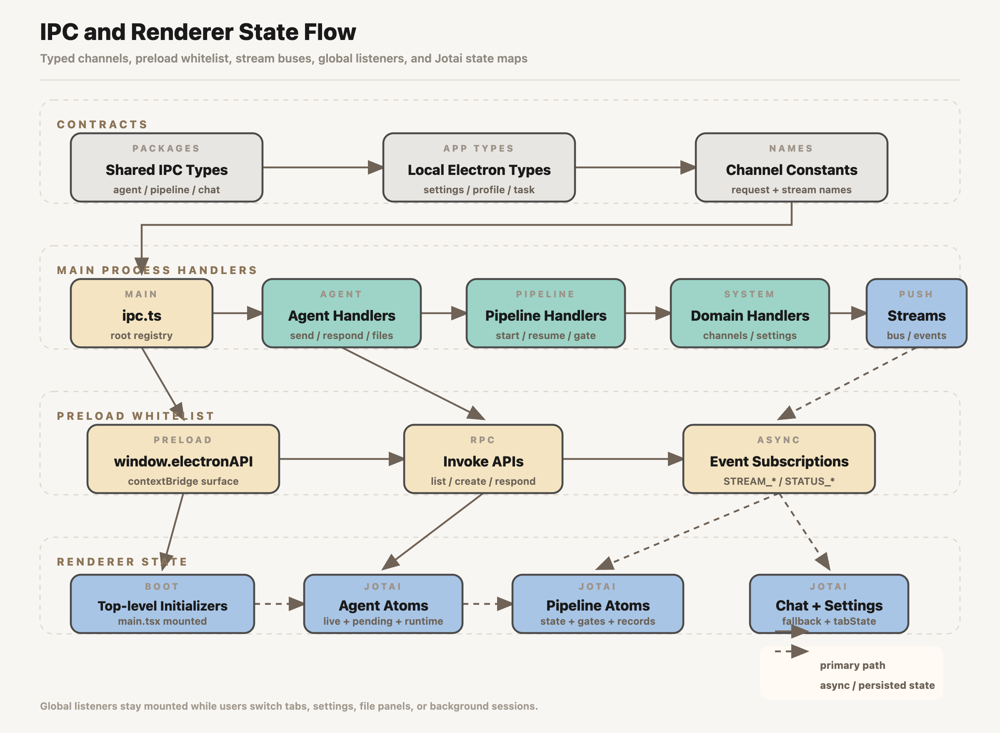

CodeInsights 的 IPC 遵循四层同步模型：

1. `packages/shared/src/types/*` 定义通道常量和请求 / 响应类型。
2. `apps/electron/src/main/ipc.ts` 或 `apps/electron/src/main/ipc/*-handlers.ts` 注册 `ipcMain.handle`。
3. `apps/electron/src/preload/index.ts` 通过 `contextBridge` 暴露 `window.electronAPI`。
4. Renderer 在 `atoms/`、`hooks/` 和组件中调用 API，并通过全局 listener 写入 Jotai 状态。

主要 IPC 域：

| 域 | 说明 |
|----|------|
| `IPC_CHANNELS` | 运行时、Git、通用系统能力 |
| `CHANNEL_IPC_CHANNELS` | AI 渠道 CRUD、连接测试、模型拉取 |
| `AGENT_IPC_CHANNELS` | Agent 会话、流式事件、权限、AskUser、工作区 |
| `PIPELINE_IPC_CHANNELS` | Pipeline 会话、记录、状态、gate、stream、提交动作 |
| `CHAT_IPC_CHANNELS` | 旧 Chat 回退会话和流式响应 |
| `ENVIRONMENT_IPC_CHANNELS` | 环境检查和安装器 |
| `PROXY_IPC_CHANNELS` | 系统代理检测和代理配置 |
| `SYSTEM_PROMPT_IPC_CHANNELS` | 系统提示词管理 |
| `MEMORY_IPC_CHANNELS` | 记忆配置和工具 |
| `CHAT_TOOL_IPC_CHANNELS` | Chat 工具配置和执行 |
| `FEISHU_IPC_CHANNELS` | 飞书配置、绑定、Bridge 状态 |
| `DINGTALK_IPC_CHANNELS` | 钉钉配置和 Bridge 状态 |
| `WECHAT_IPC_CHANNELS` | 微信配置和 Bridge 状态 |
| `QUICK_TASK_IPC_CHANNELS` | 快速任务窗口提交、隐藏、聚焦和快捷键重注册 |
| `GITHUB_RELEASE_IPC_CHANNELS` | 版本发布与更新信息 |

Renderer 全局监听器挂在 `main.tsx` 顶层，核心目的是保证切换设置页、文件面板或其他标签时，Agent / Pipeline 的流式事件仍能落入状态。

## 本地数据与配置

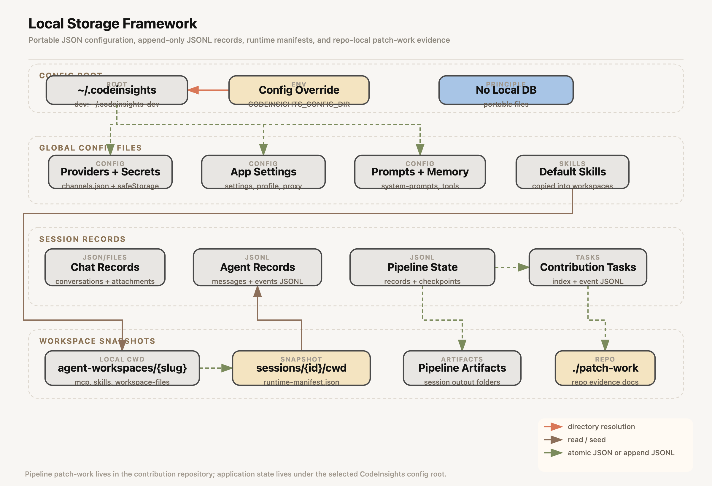

CodeInsights 默认不使用本地数据库。正式版本默认写入 `~/.codeinsights/`，开发模式默认写入 `~/.codeinsights-dev/`。可通过 `CODEINSIGHTS_CONFIG_DIR` 覆盖目录，并保留历史配置目录的自动迁移能力。

```text
~/.codeinsights/
├── channels.json
├── settings.json
├── user-profile.json
├── proxy-settings.json
├── system-prompts.json
├── memory.json
├── chat-tools.json
├── conversations.json
├── conversations/
│   └── {conversationId}.jsonl
├── attachments/
│   └── {conversationId}/
├── agent-sessions.json
├── agent-sessions/
│   ├── {sessionId}.jsonl
│   └── {sessionId}.events.jsonl
├── agent-workspaces.json
├── agent-workspaces/
│   └── {workspaceSlug}/
│       ├── mcp.json
│       ├── skills/
│       ├── skills-inactive/
│       ├── workspace-files/
│       └── sessions/{sessionId}/cwd/
├── default-skills/
├── sdk-config/
├── pipeline-sessions.json
├── pipeline-sessions/
│   └── {sessionId}.jsonl
├── pipeline-checkpoints/
│   └── {sessionId}/memory-saver.json
├── pipeline-artifacts/
│   └── {sessionId}/
├── contribution-tasks.json
├── contribution-tasks/
│   └── {taskId}.jsonl
├── feishu.json
├── feishu-bindings.json
├── dingtalk.json
├── wechat.json
├── wechat-sync.json
└── agent-channel-bindings.json
```

设计原则：

- JSON 保存配置和索引，JSONL 保存会话消息、事件记录和可回放日志。
- Pipeline checkpoint 单独服务 LangGraph interrupt / resume。
- Pipeline v2 会在目标仓库维护 `patch-work/`，保存计划、测试计划、开发记录、审查记录、结果和提交材料。
- API Key 由主进程使用 Electron `safeStorage` 加密后写入 `channels.json`。
- `sdk-config/` 用于隔离 Claude SDK 配置，避免直接污染用户的 Claude Code CLI 配置。

## Provider 适配层

`@codeinsights/core` 使用 Provider adapter registry 统一不同供应商协议：

| Provider | 适配器 | 协议 |
|----------|--------|------|
| Anthropic | `AnthropicAdapter` | Anthropic Messages |
| DeepSeek | `AnthropicAdapter('deepseek')` | Anthropic 兼容 |
| Kimi API | `AnthropicAdapter('kimi-api')` | Anthropic 兼容 |
| Kimi Coding | `AnthropicAdapter('kimi-coding')` | Anthropic 兼容 |
| OpenAI | `OpenAIAdapter` | Chat Completions |
| Moonshot / Kimi OpenAI 协议 | `OpenAIAdapter` | OpenAI 兼容 |
| 智谱、MiniMax、豆包、通义千问 | `OpenAIAdapter` | OpenAI 兼容 |
| Custom | `OpenAIAdapter` | 自定义 OpenAI 兼容端点 |
| Google | `GoogleAdapter` | Generative Language API |

渠道默认 URL、标签、Agent 兼容集合定义在 `packages/shared/src/types/channel.ts`。新增 Provider 时应同步更新 shared 类型、core registry、设置 UI 和连接测试逻辑。

## 远程 Bridge

主进程内置 Bridge registry，当前注册飞书、钉钉、微信。Bridge 启动后会把远程消息转换为桌面端 Agent / Chat 会话请求，并把运行状态和回复同步回消息平台。

常用命令：

| 命令 | 功能 |
|------|------|
| `/help` | 查看帮助 |
| `/new` | 创建新会话 |
| `/list` | 查看会话列表 |
| `/switch` | 切换会话 |
| `/stop` | 停止当前任务 |
| `/workspace` | 切换工作区 |
| `/agent` | 切换到 Agent 模式 |
| `/chat` | 切换到 Chat 模式 |
| `/now` | 查看当前绑定状态 |

## 开发指南

### 添加新的 IPC 能力

按四层同步：

1. 在 `packages/shared/src/types/*` 定义通道常量和请求 / 响应类型。
2. 在 `apps/electron/src/main/ipc.ts` 或 `apps/electron/src/main/ipc/*-handlers.ts` 注册 handler。
3. 在 `apps/electron/src/preload/index.ts` 暴露 `window.electronAPI` 方法。
4. 在 renderer 的 `atoms/`、`hooks/` 或组件中封装调用。

### 添加新的 Provider

1. 修改 `packages/shared/src/types/channel.ts`，增加 `ProviderType`、默认 URL 和显示名称。
2. 在 `packages/core/src/providers/index.ts` 注册适配器。
3. 如果要用于 Agent，确认目标端点支持 Anthropic Messages 协议，并加入 `AGENT_COMPATIBLE_PROVIDERS`。
4. 更新设置 UI、连接测试、模型拉取和必要测试。

### 修改 Pipeline 节点

优先检查这些文件：

- `packages/shared/src/types/pipeline.ts`
- `apps/electron/src/main/lib/pipeline-graph.ts`
- `apps/electron/src/main/lib/pipeline-node-router.ts`
- `apps/electron/src/main/lib/pipeline-node-runner.ts`
- `apps/electron/src/main/lib/codex-pipeline-node-runner.ts`
- `apps/electron/src/main/lib/pipeline-service.ts`
- `apps/electron/src/renderer/components/pipeline/*`

注意事项：

- v1 和 v2 的运行时路由不同，不能只改一种版本。
- 节点输出需要保持结构化 schema 可解析，并提供自然语言 fallback 的安全策略。
- 所有人工 gate 必须能持久化、恢复和回放。
- Codex 节点不能绕过 Git guard 直接写远端。

### 前端状态管理

项目状态管理统一使用 Jotai：

- 会话流式状态按 `sessionId` 存在 Map / Set 中。
- 全局 IPC listener 使用 `useStore()` 写 atoms，避免 UI 组件卸载导致丢事件。
- 展示组件保持轻量，复杂派生逻辑抽为纯函数并补测试。
- 新增本地状态前优先考虑是否应放入配置文件，而不是默认写 `localStorage`。

### 文档同步

功能或架构发生变化时，应同步检查：

- `README.md`
- `AGENTS.md`，需要用户允许后再修改
- `docs/` 中对应设计文档
- `tasks/todo.md` 的计划和 Review

## 测试与验证

常用验证命令：

```bash
bun test
bun run typecheck
bun run electron:build
```

局部验证示例：

```bash
bun run --filter='@codeinsights/electron' typecheck
bun test apps/electron/src/main/lib/pipeline-graph.test.ts
bun test apps/electron/src/main/lib/codex-pipeline-node-runner.test.ts
bun test apps/electron/src/renderer/components/pipeline/pipeline-preflight.test.ts
```

文档或 Markdown 修改至少建议运行：

```bash
git diff --check
```

## 打包发布

```bash
cd apps/electron

bun run dist:mac
bun run dist:win
bun run dist:linux
bun run dist:fast
```

### Electron Builder 要点

`apps/electron/electron-builder.yml` 当前采用：

- `asar: false`，避免 SDK symlink 和 native binary 路径问题。
- `files` 显式包含 Claude Agent SDK 主包和平台子包。
- `files` 显式包含 OpenAI Codex SDK / CLI 主包和平台子包。
- `extraResources` 包含 default-skills、tutorial 和品牌 logo 素材。
- macOS 目标为 `dmg` / `zip`，Windows 目标为 NSIS x64。

### Claude Agent SDK 打包

`@anthropic-ai/claude-agent-sdk@0.2.123` 使用平台 native binary。主进程构建必须 external：

```text
--external:@anthropic-ai/claude-agent-sdk
```

对应平台包通过 optional dependencies 安装，例如：

- `@anthropic-ai/claude-agent-sdk-darwin-arm64`
- `@anthropic-ai/claude-agent-sdk-darwin-x64`
- `@anthropic-ai/claude-agent-sdk-win32-x64`
- `@anthropic-ai/claude-agent-sdk-win32-arm64`

macOS x64 与 arm64 需要在匹配架构 runner 上分别构建，不应假设单个 Apple Silicon runner 会安装所有平台 binary。

### OpenAI Codex 打包

Pipeline Codex 节点依赖：

- `@openai/codex-sdk@0.130.0`
- `@openai/codex@0.130.0`
- `@openai/codex-{platform}-{arch}` optional dependencies

主进程构建 external：

```text
--external:@openai/codex-sdk
--external:@openai/codex
```

`codex-pipeline-node-runner.ts` 会解析平台包中的 native CLI；打包后如路径位于 asar 内，会切到 `.asar.unpacked`。当前配置禁用 asar，路径处理仍保留防御逻辑。

## 安全与边界

当前安全边界包括：

- Electron `contextIsolation: true`、`nodeIntegration: false`。
- Renderer 只能通过 preload 暴露的 `window.electronAPI` 访问主进程能力。
- API Key 通过 Electron `safeStorage` 加密存储。
- Agent 权限请求、AskUser、ExitPlan 和 Pipeline gate 都按 session 隔离。
- Pipeline v2 Codex 节点运行时会清理敏感环境变量，并隔离 `CODEX_HOME` / `HOME` / Git 相关变量。
- Codex workspace-write 节点有命令级 Git guard 和事后校验，防止 Agent 私自 commit、push、tag、reset、rebase 或创建 PR。
- Pipeline 远端写操作需要专门确认，不由普通节点自由执行。

仍需注意：

- 本项目会让 Agent 在用户工作区读取文件、编辑代码、运行命令。请只在可信工作区和可信模型渠道中使用高权限模式。
- `safeStorage` 保护的是本机加密存储，不等于跨设备密钥管理系统。
- Bridge 会把远程消息转成本地 Agent 请求，启用前应确认 Bot 权限、群聊范围和默认工作区。
- `default-skills/` 中部分技能带独立 LICENSE 文本，复用或分发时需要逐项核对。

## 素材目录

`assets/` 和 `docs/assets/readme/real-runs/` 当前包含 README、官网和介绍视频使用的素材：

| 路径 | 用途 |
|------|------|
| `assets/icon/CodeInsights.png` | 品牌图标源 |
| `assets/imgs/codeinsights-system-architecture.png` | 系统架构图 |
| `assets/imgs/codeinsights-pipeline-langgraph-flow.png` | Pipeline v2 LangGraph 流程图 |
| `assets/imgs/codeinsights-agent-runtime-flow.png` | Agent Runtime 流程图 |
| `assets/imgs/codeinsights-ipc-state-flow.png` | IPC 与状态流图 |
| `assets/imgs/codeinsights-local-storage-framework.png` | 本地存储结构图 |
| `assets/video/codeinsights-intro-20s.mp4` | 20 秒介绍视频 |
| `assets/video/snapshots/contact-sheet.jpg` | 视频关键帧预览 |
| `docs/assets/readme/real-runs/codeinsights-real-run-overview.mp4` | 真实 Electron 窗口 6 秒运行录屏 |
| `docs/assets/readme/real-runs/codeinsights-real-run-overview-contact-sheet.jpg` | 真实运行录屏抽帧预览 |
| `docs/assets/readme/real-runs/feature-01-pipeline-workflow.mp4` | Pipeline 工作流功能演示视频 |
| `docs/assets/readme/real-runs/feature-01-pipeline-workflow-poster.jpg` | Pipeline 工作流演示预览图 |
| `docs/assets/readme/real-runs/feature-02-agent-workspace.mp4` | Agent 工作区功能演示视频 |
| `docs/assets/readme/real-runs/feature-02-agent-workspace-poster.jpg` | Agent 工作区演示预览图 |
| `docs/assets/readme/real-runs/feature-03-provider-settings.mp4` | 模型与 Provider 配置功能演示视频 |
| `docs/assets/readme/real-runs/feature-03-provider-settings-poster.jpg` | 模型与 Provider 配置演示预览图 |
| `docs/assets/readme/real-runs/feature-04-agent-mcp-skills.mp4` | Agent MCP / Skills 配置功能演示视频 |
| `docs/assets/readme/real-runs/feature-04-agent-mcp-skills-poster.jpg` | Agent MCP / Skills 配置演示预览图 |
| `docs/assets/readme/real-runs/feature-demos-contact-sheet.jpg` | 四段功能演示视频预览总览 |
| `docs/assets/readme/real-runs/01-pipeline-dashboard.png` | Pipeline 工作台真实截图 |
| `docs/assets/readme/real-runs/02-agent-workbench.png` | Agent 工作区真实截图 |
| `docs/assets/readme/real-runs/03-settings-overview.png` | 模型配置真实截图 |
| `docs/assets/readme/real-runs/04-channels-and-agent-settings.png` | Agent 设置、MCP 与 Skills 真实截图 |
| `docs/assets/readme/real-runs/README.md` | 真实素材说明、采集方式和引用片段 |

同名 `.svg` 图适合需要高清缩放的文档或网页场景。

## 常见问题

### Agent 模式为什么不能直接选择 OpenAI 渠道？

当前 Agent 模式基于 Claude Agent SDK 和 Anthropic Messages 兼容协议，所以只支持 `anthropic`、`deepseek`、`kimi-api`、`kimi-coding`。OpenAI / Custom 可以作为 Pipeline Codex 渠道使用。

### Pipeline 为什么同时需要 Agent 渠道和 Codex 渠道？

Pipeline v2 是混合运行时。Explorer / Planner 使用 Claude Agent SDK，因此需要 Agent 兼容渠道；Developer / Reviewer / Tester / Committer 使用 Codex，因此可以选择 OpenAI / Custom 渠道、本机 Codex auth 或 `CODEX_API_KEY`。

### 运行中的 Pipeline 能跨重启继续吗？

不能保证。当前可靠恢复的是 `waiting_human` gate。进程已经丢失的 `running` 节点会标记为 `recovery_failed`，避免 UI 误报仍在运行。

### 开发模式看不到正式版本数据怎么办？

开发模式默认写 `~/.codeinsights-dev/`，正式版本写 `~/.codeinsights/`。可以用环境变量指定目录：

```bash
CODEINSIGHTS_CONFIG_DIR=/path/to/config bun run dev
```

## 贡献说明

欢迎围绕 Pipeline、Agent Runtime、Provider 适配、MCP / Skills、Bridge、本地存储和 UI 体验提交改进。提交前请尽量运行相关测试、类型检查和 `git diff --check`，并保持改动范围清晰。

许可证说明：当前仓库根目录未检测到独立 `LICENSE` 文件；部分 package 标注 `Apache-2.0`，应用内和历史网页存在 MIT 文案，`default-skills/` 中部分技能还带独立授权文本。正式分发、复用或商用前，请以仓库最终 LICENSE / NOTICE 文件为准。
