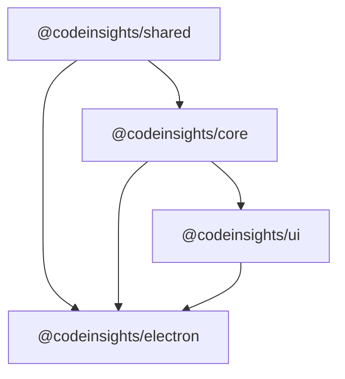

<div align="center">

<h1>CodeInsights</h1>

**[English](./README_en.md)** | **[中文](./README.md)**

</div>

CodeInsights is a local-first AI Agent desktop workspace for open source contribution, code collaboration, and long-running engineering automation. It connects mature coding-agent runtimes to an auditable, resumable, and verifiable workflow so complex contributions become staged engineering work instead of one-off chats.

<div align="center">

*Pipeline | Agent · Local First · Auditable · Replayable · Human Gates · Multi-runtime*

[](#pipeline-workflow) [](#agent-runtime) [](#pipeline-workflow) [](#local-data-and-configuration) [](#agent-runtime) [](#architecture) [](#contributing)

---

<video src="https://github.com/user-attachments/assets/64ca3efd-b424-4e09-b0ca-9c4840cf9588" controls width="900" autoplay muted loop></video>

[Homepage](https://zcxggmu.github.io/CodeInsights/)

[Highlights](#highlights) · [Real Interface](#real-interface-preview) · [Positioning](#positioning) · [Capabilities](#capabilities) · [Quick Start](#quick-start) · [Architecture](#architecture) · [Pipeline](#pipeline-workflow) · [Agent Runtime](#agent-runtime) · [Local Data](#local-data-and-configuration) · [Development](#development-guide) · [Commands](#common-commands) · [Security](#security-and-boundaries) · [Assets](#asset-catalog) · [Contributing](#contributing)

</div>

---

<a id="highlights"></a>

## Highlights

<table>
<tr>
<td width="33%" valign="top">

### Auditable Pipeline

`Pipeline` splits open source contribution work into Explorer, Planner, Developer, Reviewer, Tester, and Committer stages. Each stage has explicit artifacts, human gates, and verification evidence so work can be resumed, rerun, rolled back, or accepted with known risk.

</td>
<td width="33%" valign="top">

### Local-first Workspace

Configuration, session indexes, JSONL events, checkpoints, artifacts, and workspace files stay on the local machine by default. CodeInsights does not require a local database, which keeps migration, debugging, audit, and open source collaboration simple.

</td>
<td width="34%" valign="top">

### Mature Runtime Reuse

`Agent` mode uses Claude Agent SDK compatible runtimes. Pipeline development, review, testing, and submission-draft stages can use OpenAI Codex SDK / CLI. CodeInsights focuses on workflow, permissions, state, bridges, and local storage.

</td>
</tr>
</table>

---

<a id="real-interface-preview"></a>

## Real Interface Preview

These assets were captured from a real Electron development window with an isolated configuration directory, so existing local channels, sessions, and credentials were not loaded. The screenshots and recording focus on visible workspace states that do not require real API keys.

<table>
<tr>
<td width="50%" valign="top">

### Pipeline Workspace


The six-stage contribution pipeline, Mission Route, human gates, artifacts, and run logs are visible in one workspace.

</td>
<td width="50%" valign="top">

### Agent Workbench


Agent sessions, the Command Deck, workspace files, resource panels, and task context stay in the same local desktop flow.

</td>
</tr>
<tr>
<td width="50%" valign="top">

### Model Configuration


Provider channels, the DeepSeek preset, Pipeline Codex auth source, and Agent provider settings are managed from the settings panel.

</td>
<td width="50%" valign="top">

### Agent Settings / MCP / Skills


Advanced Agent settings, built-in tools, MCP servers, and Skills are isolated by workspace for local automation.

</td>
</tr>
</table>

---

## Positioning

CodeInsights is built around a simple premise:

1. General-purpose agents are powerful, but long-running software contribution needs engineering workflow instead of one-off chat.
2. Complex tasks need staged artifacts, human gates, verification evidence, and recovery.
3. Local configuration, sessions, checkpoints, workspace files, and artifacts should stay on the user's machine first.
4. AI runtimes do not need to be rebuilt from scratch. CodeInsights manages workflow, state, permissions, bridges, and storage while reusing Claude Agent SDK, OpenAI Codex SDK / CLI, and compatible runtimes.

Useful scenarios:

- Find contribution opportunities in an open source repository, plan the work, implement it, review it, and verify it.
- Let an agent read files, edit code, run commands, and organize information inside a local workspace.
- Trigger desktop Agent sessions from Feishu, DingTalk, or WeChat bridges.
- Combine MCP servers, Skills, workspace files, and local JSON / JSONL logs into reusable workflows.

## Capabilities

| Capability | Status | Notes |
|------------|--------|-------|
| Pipeline v2 | Integrated | Default contribution workflow with Explorer / Planner / Developer / Reviewer / Tester / Committer and human gates |
| Agent mode | Integrated | Claude Agent SDK based, with Anthropic / DeepSeek / Kimi API / Kimi Coding compatible channels |
| Codex nodes | Integrated | Pipeline development, review, testing, and submission-draft stages can use OpenAI Codex SDK with CLI fallback |
| Local-first storage | Integrated | Session indexes, JSONL events, Pipeline checkpoints, artifacts, and workspace files are stored locally |
| Multi-provider channels | Integrated | Anthropic, OpenAI, DeepSeek, Google, Moonshot / Kimi, Zhipu, MiniMax, Doubao, Qwen, and custom OpenAI-compatible endpoints |
| MCP / Skills | Integrated | MCP config, active Skills, inactive Skills, and workspace files are isolated per Agent workspace |
| IM Bridge | Integrated | Feishu, DingTalk, and WeChat bridges connect remote messages to Agent / Chat sessions |
| Permissions and human interaction | Integrated | Tool permissions, AskUser, ExitPlan, and Pipeline gates are isolated by session |
| Updates and environment checks | Integrated | Electron updater, runtime checks, system proxy, Bun / Git / Node / WSL detection |
| Legacy Chat fallback | Preserved | Provider adapters, attachments, document parsing, and tool calls remain available but are no longer the primary entry |

## Quick Start

### Requirements

- Bun `1.2.5+`
- Git
- macOS / Windows / Linux

This is a Bun workspace monorepo. Prefer `bun install` and `bun run`; do not mix npm / pnpm / yarn dependency installs.

### Run From Source

```bash
git clone https://github.com/zcxGGmu/CodeInsights.git
cd CodeInsights

bun install
bun run dev
```

`bun run dev` starts the Vite renderer, builds Electron main / preload, and runs the desktop app through electronmon. Development mode uses `~/.codeinsights-dev/` by default, so it does not pollute production data in `~/.codeinsights/`.

### Build And Start

```bash
bun run electron:build
bun run electron:start
```

### Common Commands

| Command | Description |
|---------|-------------|
| `bun run dev` | Start Electron development mode |
| `bun run electron:dev` | Alias of `bun run dev` |
| `bun run electron:build` | Build main, preload, file-preview preload, renderer, and resources |
| `bun run electron:start` | Build and start Electron |
| `bun run build` | Build workspace packages that declare a build script |
| `bun run typecheck` | Run TypeScript checks across workspace packages |
| `bun test` | Run Bun tests |

Common commands inside the Electron package:

```bash
cd apps/electron

bun run dev:vite
bun run dev:electron
bun run build:main
bun run build:preload
bun run build:preview-preload
bun run build:renderer
bun run dist:fast
```

### First Configuration

1. Create an Agent-compatible channel in Settings: `anthropic`, `deepseek`, `kimi-api`, or `kimi-coding`.
2. Create or select an Agent workspace, then configure MCP servers, Skills, and workspace files.
3. If Pipeline v2 needs Codex nodes, choose an OpenAI / Custom channel for Pipeline Codex, or use local Codex auth / `CODEX_API_KEY`.
4. Before starting a Pipeline task, check the preflight hints and make sure Agent channel, workspace, and Codex runtime are available.

## Tech Stack

| Layer | Technology |
|-------|------------|
| Runtime / package manager | Bun `1.2.5+` |
| Language | TypeScript `5+` |
| Desktop | Electron `39.5.1` |
| Frontend | React `18.3.1` |
| State | Jotai `2.17.1` |
| Styling and components | Tailwind CSS `3.4.17`, Radix UI, lucide-react |
| Renderer build | Vite `6.0.3` |
| Main / preload build | esbuild `0.24+` |
| Agent runtime | `@anthropic-ai/claude-agent-sdk@0.2.123` |
| Pipeline orchestration | `@langchain/langgraph@1.3.0` |
| Codex execution | `@openai/codex-sdk@0.130.0`, `@openai/codex@0.130.0` |
| Syntax highlighting | Shiki `3.22.0` |
| Rich text input | TipTap `3.19.0` |
| Markdown / math | React Markdown, remark-gfm, KaTeX |
| Distribution | electron-builder `25.1.8` |

## Monorepo Layout

```text
CodeInsights/
├── packages/
│   ├── shared/          # Shared types, IPC constants, config, utilities
│   ├── core/            # Provider adapters, SSE reader, Shiki highlighting
│   └── ui/              # Shared React UI components
├── apps/
│   └── electron/        # Electron desktop app
│       ├── default-skills/
│       ├── resources/
│       ├── scripts/
│       └── src/
│           ├── main/        # Main process, IPC, services
│           ├── preload/     # contextBridge API
│           └── renderer/    # React UI
├── assets/              # README / homepage / video assets
├── docs/                # Architecture, Pipeline, product, and historical docs
├── tasks/               # Current task plans and lessons
├── tutorial/            # Built-in tutorial content
├── web/                 # Static product homepage
└── web-console/         # Web Console related directory
```

Workspace packages:

| Package | Version | Responsibility |
|---------|---------|----------------|
| Root `codeinsights` | `0.1.1` | Bun workspace root |
| `@codeinsights/shared` | `0.1.42` | Shared types, IPC constants, Agent / Pipeline contracts, utilities |
| `@codeinsights/core` | `0.2.12` | Provider adapters, SSE reader, thinking capability detection, Shiki highlighting |
| `@codeinsights/ui` | `0.1.4` | Shared UI such as `CodeBlock` and `MermaidBlock` |
| `@codeinsights/electron` | `0.0.102` | Full Electron desktop app |



## Architecture


CodeInsights uses Electron's process boundary and local services:

| Layer | Entry | Responsibility |
|-------|-------|----------------|
| Main | `apps/electron/src/main/index.ts` | Window, tray, lifecycle, runtime init, IPC registration, Agent / Pipeline / Bridge / updater / watchers |
| Preload | `apps/electron/src/preload/index.ts` | Exposes the safe `window.electronAPI` whitelist through `contextBridge` |
| File Preview Preload | `apps/electron/src/preload/file-preview-preload.ts` | Isolated API for file preview windows |
| Renderer | `apps/electron/src/renderer/main.tsx` | React UI, Jotai state, global IPC listeners, theme, shortcuts, notifications |
| Packages | `packages/shared`, `packages/core`, `packages/ui` | Shared contracts, provider adapters, and reusable UI |

Key main-process service areas:

| Area | Representative files | Notes |
|------|----------------------|-------|
| Agent orchestration | `agent-orchestrator.ts`, `agent-runtime-runner.ts`, `agent-service.ts` | SDK calls, runner-v2, event stream, concurrency guard, permissions, persistence, retry |
| Agent workspace | `agent-workspace-manager.ts`, `agent-runtime-materializer.ts`, `agent-runtime-manifest-registry.ts` | Workspace CRUD, MCP, Skills, runtime snapshots, session cwd |
| Pipeline | `pipeline-service.ts`, `pipeline-graph.ts`, `pipeline-node-router.ts` | LangGraph orchestration, start / resume / stop / state, node routing |
| Pipeline execution | `pipeline-node-runner.ts`, `codex-pipeline-node-runner.ts` | Claude nodes, Codex SDK / CLI nodes, structured output parsing |
| Pipeline artifacts | `pipeline-artifact-service.ts`, `pipeline-patch-work-service.ts`, `contribution-task-service.ts` | Artifacts, patch-work, contribution task state, submission drafts |
| Channels | `channel-manager.ts` | Provider CRUD, API key encryption, connection tests, model fetching |
| Remote bridge | `bridge-registry.ts`, `feishu-*`, `dingtalk-*`, `wechat-*` | Feishu, DingTalk, WeChat connections and command handling |
| Legacy Chat | `chat-service.ts`, `conversation-manager.ts`, `chat-tools/*` | Legacy Chat, tool calls, message persistence |
| Files and documents | `attachment-service.ts`, `document-parser.ts`, `file-preview-service.ts` | Attachments, PDF / Office / text parsing, file preview |
| System services | `runtime-init.ts`, `bun-finder.ts`, `git-detector.ts`, `node-detector.ts`, `shell-env.ts` | Shell, Bun, Git, Node, WSL detection |
| Settings and updater | `settings-service.ts`, `proxy-settings-service.ts`, `updater/*` | Theme, proxy, auto-update, GitHub releases |

## Pipeline Workflow


Pipeline v2 is the default contribution workflow. It splits open source contribution into six stages and uses human gates at key points to continue, rerun, revise, or accept risk.

| Node | v2 runtime | Responsibility | Key artifacts |
|------|------------|----------------|---------------|
| Explorer | Claude Agent SDK | Read user goal and repository context, discover candidate tasks | `summary`, `findings`, `keyFiles`, `reports` |
| Planner | Claude Agent SDK | Convert selected task into plan, risks, and verification path | `plan.md`, `test-plan.md`, `steps`, `risks` |
| Developer | Codex SDK / CLI | Implement changes and add necessary tests / development notes | `dev.md`, `changedFiles`, `testsRun` |
| Reviewer | Codex SDK / CLI | Read-only review focused on correctness, regressions, test gaps, security, maintainability | `review.md`, `approved`, `structuredIssues` |
| Tester | Codex SDK / CLI | Run verification commands and collect evidence / patch-set summary | `result.md`, `testEvidence`, `patchSet` |
| Committer | Codex SDK / CLI | Draft commit message, PR title, and PR body | `commit.md`, `pr.md`, `submissionStatus` |

Important gates include `task_selection`, `document_review`, `review_iteration_limit`, `test_blocked`, `submission_review`, and `remote_write_confirmation`.

Pipeline Codex nodes use `@openai/codex-sdk` by default and can fall back to the CLI:

```bash
CODEINSIGHTS_PIPELINE_CODEX_BACKEND=cli bun run dev
```

Codex nodes include Git guards. Agent-driven nodes cannot freely commit, push, tag, reset, rebase, or create PRs; submission materials are drafted first and require explicit user confirmation before remote writes.

## Agent Runtime


Agent mode is the general autonomous execution entry point for research, code changes, file organization, automation tasks, and long-context collaboration.

```text
Renderer AgentView
  -> preload electronAPI
  -> main IPC agent handlers
  -> agent-service
  -> AgentOrchestrator
  -> Agent Runtime Runner
  -> Claude Agent SDK query()
  -> SDKMessage / RuntimeEvent stream
  -> JSONL persistence + Renderer global listeners
```

Core behavior:

- A single session has a concurrency guard, so two requests cannot write the same session at the same time.
- runner-v2 is enabled by default and emits `AgentRuntimeEvent` while preserving legacy SDKMessage JSONL.
- Permission requests, AskUser, and ExitPlan are queued by `sessionId`, so switching pages or backgrounding a session does not lose events.
- Workspaces are isolated by slug, and each new session has an independent runtime cwd.
- Runtime manifests record plugin / command / skill snapshots to avoid silently reading changed source directories at execution time.
- Agent Teams event tracking and teammate inbox collection are supported.

Agent mode currently supports Anthropic Messages compatible providers:

- `anthropic`
- `deepseek`
- `kimi-api`
- `kimi-coding`

OpenAI, MiniMax, Zhipu, Doubao, Qwen, Google, and custom OpenAI-compatible endpoints can still be used for Provider / Chat / Codex features, but not directly as Agent SDK channels.

## Local Data And Configuration


CodeInsights does not use a local database by default. Production data is written to `~/.codeinsights/`; development data is written to `~/.codeinsights-dev/`. `CODEINSIGHTS_CONFIG_DIR` can override the directory.

```text
~/.codeinsights/
├── channels.json
├── settings.json
├── user-profile.json
├── conversations.json
├── conversations/{conversationId}.jsonl
├── agent-sessions.json
├── agent-sessions/{sessionId}.jsonl
├── agent-sessions/{sessionId}.events.jsonl
├── agent-workspaces/{workspaceSlug}/
│   ├── mcp.json
│   ├── skills/
│   ├── skills-inactive/
│   ├── workspace-files/
│   └── sessions/{sessionId}/cwd/
├── pipeline-sessions.json
├── pipeline-sessions/{sessionId}.jsonl
├── pipeline-checkpoints/{sessionId}/memory-saver.json
├── pipeline-artifacts/{sessionId}/
├── contribution-tasks.json
├── contribution-tasks/{taskId}.jsonl
├── feishu.json
├── dingtalk.json
├── wechat.json
└── agent-channel-bindings.json
```

Design principles:

- JSON stores configuration and indexes; JSONL stores messages, events, and replayable logs.
- Pipeline checkpoints are separate so LangGraph interrupt / resume can be persisted.
- Pipeline v2 maintains `patch-work/` in the target repository for plans, test plans, development notes, review notes, results, and submission drafts.
- API keys are encrypted by the main process with Electron `safeStorage` before being written to `channels.json`.
- `sdk-config/` isolates Claude SDK configuration from the user's Claude Code CLI configuration.

## Provider Adapter Layer

`@codeinsights/core` uses a provider adapter registry to normalize provider protocols:

| Provider | Adapter | Protocol |
|----------|---------|----------|
| Anthropic | `AnthropicAdapter` | Anthropic Messages |
| DeepSeek | `AnthropicAdapter('deepseek')` | Anthropic-compatible |
| Kimi API | `AnthropicAdapter('kimi-api')` | Anthropic-compatible |
| Kimi Coding | `AnthropicAdapter('kimi-coding')` | Anthropic-compatible |
| OpenAI | `OpenAIAdapter` | Chat Completions |
| Moonshot / Kimi OpenAI protocol | `OpenAIAdapter` | OpenAI-compatible |
| Zhipu, MiniMax, Doubao, Qwen | `OpenAIAdapter` | OpenAI-compatible |
| Custom | `OpenAIAdapter` | Custom OpenAI-compatible endpoint |
| Google | `GoogleAdapter` | Generative Language API |

Provider defaults, labels, and the Agent-compatible provider set live in `packages/shared/src/types/channel.ts`.

## Remote Bridge

The main process includes a bridge registry for Feishu, DingTalk, and WeChat. Once a bridge is running, remote messages can be converted into desktop Agent / Chat session requests, and replies can be synchronized back to the messaging platform.

Common remote commands:

| Command | Purpose |
|---------|---------|
| `/help` | Show help |
| `/new` | Create a new session |
| `/list` | List sessions |
| `/switch` | Switch session |
| `/stop` | Stop current task |
| `/workspace` | Switch workspace |
| `/agent` | Switch to Agent mode |
| `/chat` | Switch to Chat mode |
| `/now` | Show current binding |

## Development Guide

### Add A New IPC Capability

Follow the four-layer IPC model:

1. Define channel constants and request / response types in `packages/shared/src/types/*`.
2. Register handlers in `apps/electron/src/main/ipc.ts` or `apps/electron/src/main/ipc/*-handlers.ts`.
3. Expose methods in `apps/electron/src/preload/index.ts`.
4. Wrap calls from renderer `atoms/`, `hooks/`, or components.

### Add A New Provider

1. Update `packages/shared/src/types/channel.ts` with `ProviderType`, default URL, and label.
2. Register the adapter in `packages/core/src/providers/index.ts`.
3. If it should work with Agent mode, confirm that the endpoint supports Anthropic Messages and add it to `AGENT_COMPATIBLE_PROVIDERS`.
4. Update Settings UI, connection testing, model fetching, and tests.

### Frontend State

State management uses Jotai:

- Streaming session state is stored in Map / Set structures keyed by `sessionId`.
- Global IPC listeners use `useStore()` so events are not lost when UI components unmount.
- Display components stay lightweight; complex derived logic should be extracted into pure functions with tests.
- New local state should prefer configuration files over `localStorage` unless there is a specific reason.

## Testing And Verification

Common verification commands:

```bash
bun test
bun run typecheck
bun run electron:build
```

Focused examples:

```bash
bun run --filter='@codeinsights/electron' typecheck
bun test apps/electron/src/main/lib/pipeline-graph.test.ts
bun test apps/electron/src/main/lib/codex-pipeline-node-runner.test.ts
bun test apps/electron/src/renderer/components/pipeline/pipeline-preflight.test.ts
```

For documentation-only changes, at minimum run:

```bash
git diff --check
```

## Packaging

```bash
cd apps/electron

bun run dist:mac
bun run dist:win
bun run dist:linux
bun run dist:fast
```

Packaging notes:

- Electron Builder uses `asar: false` to avoid SDK symlink and native binary path issues.
- Claude Agent SDK and OpenAI Codex SDK / CLI are externalized from main-process bundling and included through platform packages.
- macOS x64 and arm64 should be built on matching runners because optional dependencies are filtered by OS / CPU.

## Security And Boundaries

Current boundaries:

- Electron `contextIsolation: true`, `nodeIntegration: false`.
- Renderer can access main-process capabilities only through preload's `window.electronAPI`.
- API keys are encrypted with Electron `safeStorage`.
- Agent permission requests, AskUser, ExitPlan, and Pipeline gates are isolated by session.
- Pipeline v2 Codex nodes clean sensitive environment variables and isolate `CODEX_HOME` / `HOME` / Git-related variables.
- Codex workspace-write nodes have command-level Git guards and post-run checks to prevent private commits, pushes, tags, resets, rebases, or PR creation.
- Remote writes require explicit confirmation.

Operational cautions:

- CodeInsights lets agents read files, edit code, and run commands in user workspaces. Use high-permission modes only in trusted workspaces and with trusted model channels.
- `safeStorage` protects local encrypted storage; it is not a cross-device key management system.
- Bridges turn remote messages into local Agent requests, so confirm bot permissions, group scope, and default workspace before enabling them.
- Some files in `default-skills/` carry their own LICENSE text and need separate review before reuse or distribution.

## Asset Catalog

`assets/` and `docs/assets/readme/real-runs/` contain README, homepage, intro-video, and real-run assets:

| Path | Purpose |
|------|---------|
| `assets/icon/CodeInsights.png` | Brand icon source |
| `assets/imgs/codeinsights-system-architecture.png` | System architecture diagram |
| `assets/imgs/codeinsights-pipeline-langgraph-flow.png` | Pipeline v2 LangGraph flow |
| `assets/imgs/codeinsights-agent-runtime-flow.png` | Agent Runtime flow |
| `assets/imgs/codeinsights-ipc-state-flow.png` | IPC and renderer state flow |
| `assets/imgs/codeinsights-local-storage-framework.png` | Local storage structure |
| `assets/video/codeinsights-intro-20s.mp4` | 20-second intro video |
| `assets/video/snapshots/contact-sheet.jpg` | Video contact sheet |
| `docs/assets/readme/real-runs/codeinsights-real-run-overview.mp4` | 6-second real Electron window recording |
| `docs/assets/readme/real-runs/codeinsights-real-run-overview-contact-sheet.jpg` | Contact sheet for the real run recording |
| `docs/assets/readme/real-runs/01-pipeline-dashboard.png` | Real Pipeline workspace screenshot |
| `docs/assets/readme/real-runs/02-agent-workbench.png` | Real Agent workbench screenshot |
| `docs/assets/readme/real-runs/03-settings-overview.png` | Real model configuration screenshot |
| `docs/assets/readme/real-runs/04-channels-and-agent-settings.png` | Real Agent settings, MCP, and Skills screenshot |
| `docs/assets/readme/real-runs/README.md` | Real-run asset notes, capture method, and markdown snippets |

The matching `.svg` diagrams are useful for high-resolution documentation or web pages.

## FAQ

### Why can't Agent mode directly use OpenAI channels?

Agent mode is based on Claude Agent SDK and the Anthropic Messages compatible protocol. It currently supports `anthropic`, `deepseek`, `kimi-api`, and `kimi-coding`. OpenAI / Custom channels can be used for Pipeline Codex.

### Why does Pipeline need both Agent and Codex channels?

Pipeline v2 is a hybrid runtime. Explorer / Planner use Claude Agent SDK and need an Agent-compatible channel. Developer / Reviewer / Tester / Committer use Codex and can use OpenAI / Custom channels, local Codex auth, or `CODEX_API_KEY`.

### Can a running Pipeline continue across app restarts?

Not reliably. Reliable recovery currently applies to `waiting_human` gates. A lost `running` node is marked as `recovery_failed` so the UI does not pretend that a background task is still running.

### Why can't development mode see production data?

Development mode writes to `~/.codeinsights-dev/`; production writes to `~/.codeinsights/`. Override the directory when needed:

```bash
CODEINSIGHTS_CONFIG_DIR=/path/to/config bun run dev
```

## Contributing

Contributions around Pipeline, Agent Runtime, provider adapters, MCP / Skills, bridges, local storage, and UI experience are welcome. Before submitting, run the relevant tests, type checks, and `git diff --check`, and keep the change scope clear.

License note: the repository root currently does not include a standalone `LICENSE` file. Some packages declare `Apache-2.0`, application and historical web text mention MIT, and some files in `default-skills/` include independent license text. For formal distribution, reuse, or commercial use, rely on the final repository LICENSE / NOTICE files.
