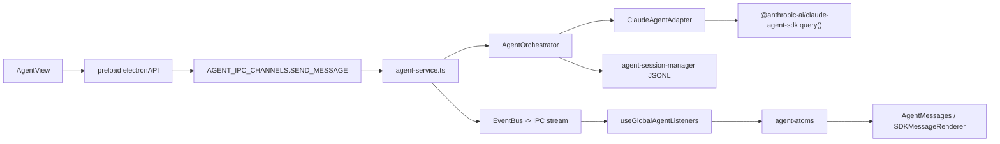

# 当前现状与差距

## 当前 Agent 链路

CodeInsights 当前 Agent 模式的主链路如下：



关键文件：

- `apps/electron/src/renderer/components/agent/AgentView.tsx`
- `apps/electron/src/preload/index.ts`
- `apps/electron/src/main/ipc/agent-handlers.ts`
- `apps/electron/src/main/lib/agent-service.ts`
- `apps/electron/src/main/lib/agent-orchestrator.ts`
- `apps/electron/src/main/lib/adapters/claude-agent-adapter.ts`
- `apps/electron/src/main/lib/agent-session-manager.ts`
- `apps/electron/src/renderer/hooks/useGlobalAgentListeners.ts`
- `apps/electron/src/renderer/atoms/agent-atoms.ts`

## 已经做对的部分

1. **已经使用 Claude Agent SDK**
   `ClaudeAgentAdapter` 最终调用 SDK `query()`，而不是纯 API prompt chain。

2. **使用 Claude Code preset**
   `AgentOrchestrator` 使用 `systemPrompt: { type: 'preset', preset: 'claude_code', append: ... }`，方向正确。

3. **已有 workspace / MCP / Skill 概念**
   `agent-workspace-manager.ts` 已管理工作区、MCP 配置、Skills、附加目录，具备迁移到 runtime materialization 的基础。

4. **全局监听避免页面卸载丢流**
   `useGlobalAgentListeners` 在 `main.tsx` 顶层挂载，后台会话流式状态不会因组件卸载丢失。

5. **已有 SDKMessage 持久化基础**
   `agent-session-manager.ts` 已支持 SDKMessage JSONL，具备向 SDK 原生 transcript 对齐的基础。

## 当前主要问题

### 1. AgentOrchestrator 过重

`agent-orchestrator.ts` 同时承担：

- 渠道和模型解析
- SDK env 构建
- 工作区 cwd 选择
- prompt 构建
- MCP 注入
- 记忆工具注入
- 权限调度
- AskUser / ExitPlan
- SDK stream 遍历
- 自动重试
- SDK session 恢复
- Teams auto-resume
- 消息持久化
- 标题生成
- rewind / fork

这导致 Agent runtime 的边界不清晰。后续要支持外部渠道、不同 runner 或更原生的 Claude Code 能力时，必须继续往这个文件里堆逻辑。

建议拆分去向：

| 当前职责 | 目标归属 | 迁移说明 |
| --- | --- | --- |
| 渠道、模型、工作区解析 | `AgentRuntimeService` | 输入校验、默认值、session metadata 仍是应用职责 |
| SDK env、binary path、query options | `AgentRuntimeRunner` | 保留 `buildSdkEnv()` 的安全语义，但移动到 Runner 附近 |
| MCP/Skill/Plugin 配置拼装 | `RuntimeMaterializer` | Orchestrator 不直接拼路径，只读取 manifest |
| SDK stream 遍历 | `AgentRuntimeRunner` | 统一转换成 `AgentStreamEnvelope` |
| 权限 pending queue | `AgentPermissionService` | Runner 通过 callback 请求权限，service 管理队列 |
| AskUser / ExitPlan | 主进程 service + Runner event | 交互请求要变成可重放事件 |
| JSONL SDKMessage 存储 | `AgentSessionManager` | 继续保留，但和 runtime event log 分层 |
| 标题生成 | `AgentRuntimeService` 或独立 title service | 不阻塞 Runner，失败不影响 run completed |
| fork / rewind | `AgentRuntimeService` + storage adapter | 先兼容旧语义，再映射到 SDK resume point |

### 2. 事件模型双轨

当前主进程发 `AgentStreamPayload`，Renderer 里还有 `payloadToLegacyEvents()` 转成旧 `AgentEvent`，再进入 `applyAgentEvent()`。

问题：

- SDKMessage、AgentEvent、ToolActivity、UI state 四层模型互相转换。
- Renderer 依赖 SDKMessage 内部结构和本地推断逻辑。
- 新增 Claude Code 原生事件时，需要同时改 shared、listener、atoms、renderer。

当前事件层可以拆成四类：

| 层级 | 当前形态 | 问题 | 目标形态 |
| --- | --- | --- | --- |
| 原始层 | `SDKMessage` | 适合调试和 transcript，不适合直接驱动 UI | 原样持久化，作为高级视图数据 |
| 传输层 | `AgentStreamPayload` | 混合 SDK 原文、增量状态和 legacy 字段 | `AgentStreamEnvelope` |
| 语义层 | `AgentEvent` | 类型较粗，工具/权限/usage 不完整 | `AgentRuntimeEvent` |
| 展示层 | `AgentStreamState` / `ToolActivity` | 由多处推断生成，难回放 | 单一 reducer 从 envelope 重建 |

事件收敛的第一原则是：Renderer 不再需要理解 SDKMessage 的细节才能展示实时状态。SDKMessage 可以继续作为“原始 transcript”，但实时 UI 只看 shared runtime event。

### 3. 仍在重建 Claude Code 行为

当前一些逻辑已经接近自研 runtime：

- `PermissionToolDispatcher` 在 SDK `canUseTool` 外重做权限状态机。
- `TeamsCoordinator` 和 auto-resume 试图托管 Claude teams / task 输出收集。
- `context-rehydration` 在 resume 失败时手工拼历史 prompt。
- 自定义 `toolActivities` 从 SDK blocks 重新组装工具时间线。
- `agent-prompt-builder.ts` 注入较多应用级上下文。

这些不是错误，但需要重新评估：哪些必须由应用托管，哪些应回归 Claude Code 原生机制或 Runner 内部。

保留边界建议：

- 必须由 CodeInsights 托管：权限 UI、用户确认、工作区文件可视化、本地配置、外部渠道格式化、应用内记忆服务。
- 应回归 Claude Code / SDK：工具执行语义、SubAgent 调度、session resume、MCP 工具发现、Skill/Plugin 加载、Claude Code preset prompt。
- 可以薄封装：错误分类、usage 汇总、标题生成、运行时状态统计。
- 应避免继续扩展：手工拼接历史 prompt 复原 Claude session、从文本中推断工具状态、在 prompt 中硬编码宿主能力清单。

### 4. 工作区结构与 Claude runtime 没有完全对齐

当前本地结构是：

```text
~/.codeinsights/
  agent-workspaces/{workspace-slug}/
    {session-id}/
    workspace-files/
    mcp.json
    skills/
  sdk-config/
```

它能工作，但还没有明确区分：

- 应用配置目录
- Claude runtime 配置目录
- workspace persistent files
- session cwd
- plugin runtime snapshot
- skills discovery path
- shared attachments

happyclaw 的关键启发不是具体目录名，而是 runtime 目录必须能被 Claude Code 原生发现，并可被应用稳定物化。

现有目录迁移需要兼顾三类数据：

| 数据类型 | 当前位置 | 目标位置 | 迁移策略 |
| --- | --- | --- | --- |
| 工作区应用配置 | `agent-workspaces/{slug}/mcp.json`、skills 等 | `workspace.json` + `runtime/` | 旧文件继续读取，新写入 manifest |
| 用户可见文件 | `workspace-files/` | 保持 `workspace-files/` | 不移动，避免破坏用户路径 |
| 会话工作目录 | `{session-id}/` | `sessions/{session-id}/cwd/` | 新会话使用新路径，旧会话兼容 |
| Claude runtime 配置 | `sdk-config/` 和 workspace 混合 | `runtime/.claude/` + `runtime/mcp.json` | Materializer 统一生成 |
| 附件 | 全局 attachments 或 session 关联 | `sessions/{session-id}/attachments/` | 先记录引用，后续再做可选迁移 |
| SDK 原始 transcript | session JSONL | 保留 JSONL | 增加 runtime event log，不替代原始 transcript |

### 5. 飞书等外部渠道与 Agent 核心耦合不够清晰

项目已有 `feishu-bridge.ts`、`dingtalk-bridge.ts`、`wechat-bridge.ts` 等集成，但 Agent 核心仍主要服务 Electron UI。外部渠道应该只是同一 Agent runtime 的入口和出口，而不是单独适配 Agent 逻辑。

目标不是把桌面应用改成 happyclaw 那样的 IM-first 产品，而是把渠道差异固定在 adapter 层：

- 输入侧：不同渠道都转成 `AgentTurnInput`，包含 `workspaceId`、`sessionId`、`author`、`content`、`attachments`、`source`。
- 输出侧：不同渠道都消费 `AgentStreamEnvelope`，按能力降级展示。
- 权限侧：Electron 可以完整弹横幅，飞书可以发送确认卡片，微信可以回退为短链或等待桌面确认。
- 存储侧：同一 session metadata 记录多个 channel target，不创建独立 Agent runtime。

## 待迁移模块清单

| 模块 | 当前问题 | 建议处理 | 优先级 |
| --- | --- | --- | --- |
| `agent-orchestrator.ts` | 运行时、权限、事件、存储全部混合 | 分阶段瘦身，最终只保留兼容入口或删除 | P0 |
| `claude-agent-adapter.ts` | 与 Runner 边界重叠 | 先保留，Runner 稳定后合并或删除 | P1 |
| `agent-session-manager.ts` | SDKMessage 与 UI 状态存储边界不清 | 增加 event log / manifest 引用，不破坏旧 JSONL | P0 |
| `agent-workspace-manager.ts` | workspace 配置与 Claude runtime 混合 | 拆出 Registry / Materializer | P0 |
| `useGlobalAgentListeners.ts` | payload 转 legacy event | 双跑新 reducer，最终只消费 envelope | P0 |
| `agent-atoms.ts` | 状态依赖 legacy event reducer | 增加 event-sourced reducer fixture | P0 |
| `feishu-bridge.ts` | 外部渠道没有统一 AgentChannel 边界 | 迁移为 Channel Adapter | P2 |
| `pipeline-node-runner.ts` | 重复 Claude SDK 执行逻辑 | 后期复用 AgentRuntimeRunner | P2 |

## 当前行为基线

正式实现前，至少要记录这些现有行为，作为回归基线：

- 新建 Agent session 后能发送首条消息，自动生成标题。
- 同一 session 并发发送被阻止或排队策略一致。
- 停止运行后 UI 清理 loading，后台 SDK 中止。
- `safe / ask / allow-all / plan` 权限模式表现一致。
- 权限请求、AskUser、ExitPlan 在切换页面后仍可响应。
- MCP server 配置变更后，新 run 能看到变化。
- Skills 配置变更后，新 run 能看到变化。
- 文件上传、附加目录、右侧文件面板定位不回退。
- 旧 session 能打开、继续、fork、rewind。
- Pipeline 现有节点执行不受 Agent runner 迁移影响，直到进入复用阶段。

## 与 happyclaw 的核心差距

| 维度 | CodeInsights 当前 | happyclaw 思路 | CodeInsights 迁移方向 |
| --- | --- | --- | --- |
| 执行边界 | Electron 主进程内 Orchestrator 直接调 SDK | 宿主调度器 + 独立 Agent Runner | 增加本地 Runner 边界 |
| 运行时理念 | SDK 包装较厚 | Claude Code 原生优先 | 减少自研 runtime 行为 |
| 事件协议 | SDKMessage + legacy AgentEvent 双轨 | shared StreamEvent 单一协议 | 收敛 shared event contract |
| 插件能力 | workspace local plugin 初步接入 | catalog -> enabled -> materialized runtime -> SDK plugins | 引入 workspace plugin runtime |
| MCP | workspace MCP + 内置注入 | 用户 MCP + 内置 MCP 桥 | 内置宿主能力改为 MCP bridge |
| 渠道 | Electron UI 为主，飞书桥接 | IM/Web 都是统一入口 | 外部渠道复用 Agent Runtime Service |
| 存储 | 本地 JSON/JSONL | SQLite + data dirs | 保留本地文件，不迁移 DB |
| 隔离 | 本机 cwd + 权限模式 | Docker/host 双运行时 | 先做 runner 边界，不默认 Docker |
