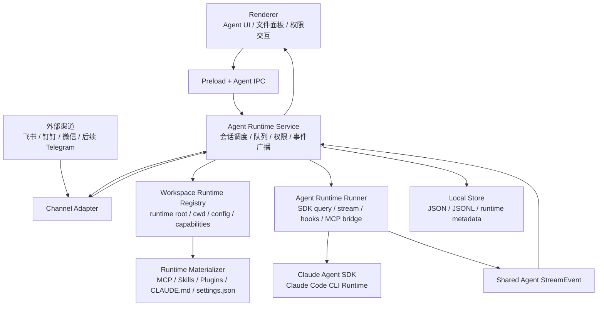
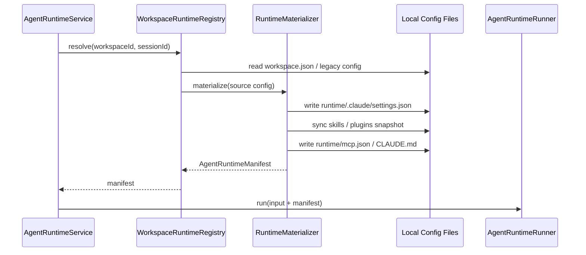

# 目标架构

## 总体形态

目标是把 Agent 模式重构为“本地 Claude Code runtime cockpit”：



## 模块边界

### 1. Agent Runtime Service

位置建议：

- `apps/electron/src/main/lib/agent-runtime-service.ts`
- 后续可替换当前 `agent-service.ts` 的主执行职责。

职责：

- 统一接收 Electron UI、飞书等渠道的 Agent 请求。
- 管理 session running 状态、队列、停止、并发保护。
- 调用 Workspace Runtime Registry 解析运行时。
- 启动 Agent Runtime Runner。
- 把 Runner 事件广播到 Electron IPC 和外部渠道。
- 维护应用级 session metadata。
- 调用权限服务，但不直接解析 SDK 工具 block。

不负责：

- 不拼大段 Claude Code system prompt。
- 不手工重建工具时间线。
- 不直接处理 SDK query 细节。

建议输入输出：

```ts
interface AgentTurnInput {
  sessionId: string;
  workspaceId: string;
  channelType: 'electron' | 'feishu' | 'dingtalk' | 'wechat' | 'telegram' | 'pipeline';
  channelTarget: AgentChannelTarget;
  actor: AgentActorRef;
  sessionBinding: AgentSessionBindingRef;
  prompt: string;
  attachments: AgentAttachmentRef[];
  sourceMetadata: Record<string, unknown>;
  capabilities: AgentChannelCapabilities;
  permissionPolicy: AgentChannelPermissionPolicy;
  requestedModel?: string;
  permissionMode?: AgentPermissionMode;
  resume?: AgentResumeOptions;
}

interface AgentRunHandle {
  runId: string;
  sessionId: string;
  abort(): Promise<void>;
  events: AsyncIterable<AgentStreamEnvelope>;
}
```

Service 的关键状态：

- `runningRuns: Map<sessionId, runId>`：同一 session 的并发守卫。
- `pendingPermissions: Map<requestId, PermissionRequest>`：权限 UI 和外部渠道共用。
- `pendingInteractions: Map<requestId, AskUserRequest | ExitPlanRequest>`：用户交互等待。
- `channelTargets: Map<sessionId, AgentChannelTarget[]>`：同一 session 可有多个输出端。
- `runtimeManifestCache: Map<workspaceId, AgentRuntimeManifest>`：避免每次 run 重复扫描。

### 2. Agent Runtime Runner

位置建议：

- 第一阶段可在主进程内做 class：`apps/electron/src/main/lib/agent-runtime-runner.ts`
- 第二阶段可进程隔离：`apps/electron/src/main/agent-runner/`

职责：

- 调用 `@anthropic-ai/claude-agent-sdk` 的 `query()`。
- 传入 Claude 原生参数：`cwd`、`env`、`systemPrompt preset`、`append`、`mcpServers`、`plugins`、`agents`、`resume`、`resumeSessionAt`、`allowedTools`、`disallowedTools`、`canUseTool`。
- 将 SDK 原始消息转换为 shared `AgentStreamEvent`。
- 维护 SDK session id、resume point、result subtype、usage。
- 处理 SDK 层错误、resume 失败、timeout、abort。
- 通过 in-process MCP 暴露 RV-Insights 宿主能力。

不负责：

- 不管理 UI 状态。
- 不直接调用 Electron `webContents.send`。
- 不知道飞书/钉钉/微信细节。

Runner 输入建议：

```ts
interface AgentRuntimeRunInput {
  sessionId: string;
  runId: string;
  prompt: string;
  startedAt: string;
  cwd: string;
  env: Record<string, string>;
  sdkCliPath: string;
  model: string;
  provider: AgentProviderRuntimeConfig;
  permissionMode: AgentPermissionMode;
  runtime: AgentRuntimeManifest;
  sdkSession?: SdkSessionRef;
  attachments: AgentAttachmentRef[];
  additionalDirectories: RuntimeDirectoryRef[];
  mentionedSkills: RuntimeSkillRef[];
  mentionedMcpServers: RuntimeMcpServerRef[];
  systemPromptAppend: string;
  thinking?: AgentThinkingOptions;
  maxTurns?: number;
  maxBudgetUsd?: number;
  betas?: string[];
  enableFileCheckpointing?: boolean;
  abortSignal: AbortSignal;
  callbacks: AgentRuntimeCallbacks;
}

interface AgentRuntimeCallbacks {
  requestPermission(request: RuntimePermissionRequest): Promise<RuntimePermissionDecision>;
  requestUserInput(request: RuntimeAskUserRequest): Promise<RuntimeAskUserResponse>;
  onSdkSessionId(sessionId: string): Promise<void>;
  onModelResolved(model: string): Promise<void>;
  onContextWindow(update: RuntimeContextWindowUpdate): Promise<void>;
  onStderr(line: string): Promise<void>;
  emitAudit(entry: AgentAuditEntry): Promise<void>;
}
```

Runner 输出要求：

- 所有输出必须带 `runId`、`sessionId`、单调递增 `sequence`。
- SDK 原始 message 可以通过 `raw_sdk_message` 或 debug 字段持久化，但 UI 事件必须是稳定语义。
- `run_completed` 只能在 SDK stream 正常结束、持久化完成、最终 usage 写入后发送。
- `run_stopped` 必须区分用户停止、AbortSignal、权限拒绝导致的停止。
- `run_failed` 必须包含错误分类，而不是只传 message。

Runner 持久化边界：

- Runner 不直接写 Electron IPC，也不更新 Jotai。
- Runner 可以把 SDK 原始 message 交给 `AgentSessionManager.appendSDKMessages()`，但必须通过注入的 store 接口完成，便于测试和回滚。
- Runtime Service 负责写 `AgentStreamEnvelope` event log，并决定哪些事件广播到渠道。
- 错误 SDKMessage、retry 中间态、deferred result 都必须先转换为 envelope，再由 service/store 持久化。
- 标题生成、channel final message 发送不属于 Runner 持久化职责。

`AgentProviderAdapter` 关系：

- 阶段 2 早期，Runner 可以复用 `ClaudeAgentAdapter` 作为 SDK query 薄包装，避免一次性搬迁所有参数。
- 阶段 2 完成后，SDK query、env、callback、abort 统一进入 Runner；`ClaudeAgentAdapter` 只保留类型兼容或被删除。
- 不再新增第二个 provider adapter 来表达 Claude Code runtime，Runner 是唯一 Claude Code 执行入口。

中止语义：

| 场景 | run 终态 | 说明 |
| --- | --- | --- |
| 用户点击停止 | `run_stopped(reason: "user_abort")` | Service 调用 AbortController，Runner 清理 SDK stream |
| 权限拒绝关键工具 | `run_stopped(reason: "permission_denied")` 或 SDK 继续 | 取决于 SDK 是否能继续；必须发 permission_resolved |
| watchdog 超时 | `run_failed(errorKind: "timeout")` | 属于异常，不伪装成用户停止 |
| SDK `terminal_reason` | `run_completed` 或 `run_failed` | 按 SDK result subtype 映射 |
| queued message 被取消 | 不产生 run_started | 只更新队列状态 |
| deferred result 迟到 | 同一 `runId` 补齐终态 | 不能新建 runId，避免 UI 出现两个完成 |

错误分类建议：

| 分类 | 含义 | UI 处理 |
| --- | --- | --- |
| `sdk_unavailable` | SDK binary / optionalDependency 缺失 | 提示环境修复 |
| `auth_failed` | API Key、渠道鉴权或模型权限失败 | 引导检查渠道 |
| `runtime_config_invalid` | MCP/Plugin/Skill 配置无法物化 | 展示配置错误 |
| `permission_denied` | 用户拒绝关键工具 | 标记为已阻止，不作为崩溃 |
| `aborted` | 用户停止或应用中止 | 展示已停止 |
| `timeout` | watchdog 或长时间无响应中断 | 提示可重试 |
| `resume_failed` | SDK session 恢复失败 | 提供 fallback / 新 run |
| `unknown` | 未分类异常 | 记录 raw error，提示查看日志 |

错误事件结构建议：

```ts
interface AgentRuntimeErrorPayload {
  errorKind: AgentRuntimeErrorKind;
  code: string;
  title: string;
  message: string;
  retryable: boolean;
  suggestedActions: AgentErrorAction[];
  originalError?: {
    name?: string;
    message?: string;
    stack?: string;
  };
}
```

### 3. Workspace Runtime Registry

位置建议：

- 扩展 `agent-workspace-manager.ts`
- 或拆出 `agent-runtime-registry.ts`

职责：

- 把 workspace slug/session id 映射为 runtime paths。
- 生成 Claude runtime 配置：
  - `cwd`
  - `CLAUDE_CONFIG_DIR`
  - `.claude/settings.json`
  - `.claude/skills`
  - plugin runtime path
  - workspace MCP config
  - attached directories
- 做路径安全检查。
- 保证配置文件优先、本地可读。

建议目录模型：

```text
~/.rv-insights/
  agent-workspaces/
    {workspace-slug}/
      workspace.json
      workspace-files/
      runtime/
        CLAUDE.md
        .claude/
          settings.json
          skills/
          plugins/
        mcp.json
      sessions/
        {session-id}/
          cwd/
          attachments/
          .context/
          session.json
```

说明：

- `workspace.json` 是 RV-Insights 应用配置。
- `runtime/` 是 Claude Code 可发现的 runtime 配置。
- `sessions/{session-id}/cwd` 是每个会话默认工作目录。
- `workspace-files/` 是工作区共享文件。
- 不引入数据库。

建议 manifest：

```ts
interface AgentRuntimeManifest {
  manifestVersion: 1;
  materializerVersion: string;
  workspaceId: string;
  workspaceSlug: string;
  sessionId?: string;
  workspaceRoot: string;
  runtimeRoot: string;
  claudeConfigDir: string;
  defaultCwd: string;
  sessionCwd?: string;
  mcpConfigPath: string;
  settingsPath: string;
  claudeMdPath: string;
  skillsDir: string;
  pluginsDir: string;
  settingsHash: string;
  mcpHash: string;
  skillsSnapshotHash: string;
  pluginsSnapshotHash: string;
  enabledMcpServers: RuntimeMcpServerRef[];
  enabledSkills: RuntimeSkillRef[];
  enabledPlugins: RuntimePluginRef[];
  additionalDirectories: RuntimeDirectoryRef[];
  hostBridge: RuntimeHostBridgeConfig;
  createdAt: string;
  updatedAt: string;
  generatedAt: string;
  sourceConfigHash: string;
}
```

路径安全要求：

- 所有 workspace/session path 必须先 `resolve`，再对已存在路径段做 `lstat`，拒绝 symlink 穿越。
- 物化前确认目标仍在 `~/.rv-insights/agent-workspaces/{slug}` 真实路径内。
- 删除或清理 runtime snapshot 时只允许操作 manifest 管理的目录。
- 用户附加目录不复制进 runtime，只记录引用和只读/读写权限。

### 4. Runtime Materializer

职责：

- 从 workspace 配置物化 Claude runtime。
- 合并 MCP servers。
- 将 enabled Skills 链接或复制到 `.claude/skills`。
- 将 enabled Plugins 物化为 runtime snapshot，并传给 SDK `options.plugins`。
- 写入 `settings.json` 中 RV 必须控制的 env / MCP / plansDirectory。
- 对用户配置做最小覆盖，避免重写整个 settings。

happyclaw 可借鉴点：

- plugin 三段式：catalog -> enabled refs -> materialized runtime。
- DMI slash command 可由应用展开，非 DMI plugin command 交给 SDK。
- 不为具体插件写死逻辑。

RV-Insights 不应照搬点：

- per-user SaaS runtime root。
- Docker mount 路径。
- 多用户权限与管理员共享工作区。

物化流程建议：



Materializer 写文件原则：

- 生成文件带 `generatedBy: "rv-insights"` 或注释说明，便于用户识别。
- 用户可编辑文件和应用生成文件分离，避免覆盖用户手写内容。
- 每次物化计算 `sourceConfigHash`，配置未变化时跳过写入。
- plugins 使用 snapshot，不直接从用户全局 plugin 目录执行。
- skills 可以优先 symlink，但在打包或跨卷失败时回退复制；manifest 记录实际策略。

settings 合并策略：

- RV 只管理明确白名单 key：`permissions`、`mcpServers` 引用、`enabledPlugins`、`plansDirectory`、`skipWebFetchPreflight`、必要 env。
- 用户手写 key 不覆盖；冲突时写入 `.rv-insights-conflicts.json` 并发 `runtime_config_invalid`，不静默覆盖。
- `plansDirectory` 继续指向 session cwd 下的计划目录，确保旧 plan/exit-plan 行为可恢复。
- 渠道临时 MCP，例如飞书群聊 `feishu_chat`，不写 workspace 级 manifest；作为 run-scoped MCP overlay 传入 Runner，并在 event source 中记录 channel target。

Skill 物化策略：

- 现有 `skills/` 与 `skills-inactive/` 继续作为 UI 管理目录。
- Materializer 将启用技能物化到 runtime snapshot，可用 symlink 时 symlink，不可用时复制。
- 如果现有 Skill 依赖 `.claude-plugin/plugin.json` 被 SDK 发现，Materializer 保留该 manifest 并在 runtime plugins snapshot 中建立兼容引用。
- manifest 记录每个 skill 的 `sourcePath`、`snapshotPath`、`hash`、`materializeMode`。

### 5. Channel Adapter

职责：

- Electron UI、飞书、钉钉、微信、后续 Telegram 都只是 channel。
- channel 输入统一成 `AgentTurnInput`。
- channel 输出消费 `AgentStreamEvent`。
- channel 不知道 SDKMessage 内部结构。

建议抽象：

```ts
interface AgentChannel {
  readonly type: 'electron' | 'feishu' | 'dingtalk' | 'wechat' | 'telegram';
  sendEvent(target: AgentChannelTarget, event: AgentStreamEvent): Promise<void>;
  sendFinal(target: AgentChannelTarget, result: AgentRunResult): Promise<void>;
}
```

Electron IPC 是默认 channel，飞书等只是额外 channel。

### 6. Shared Agent StreamEvent

统一事件建议：

```ts
interface AgentStreamEnvelope {
  sessionId: string;
  runId: string;
  sequence: number;
  createdAt: number;
  event: AgentStreamEvent;
}
```

事件类型至少覆盖：

- `run_started`
- `sdk_session`
- `assistant_delta`
- `assistant_message`
- `tool_started`
- `tool_progress`
- `tool_completed`
- `permission_requested`
- `permission_resolved`
- `ask_user_requested`
- `ask_user_resolved`
- `plan_mode_entered`
- `plan_mode_exited`
- `usage_updated`
- `compact_started`
- `compact_completed`
- `retry_scheduled`
- `run_completed`
- `run_failed`
- `run_stopped`

设计原则：

- Renderer 只消费此协议。
- SDKMessage 可作为调试/高级视图持久化，但不是 UI 状态的唯一输入。
- 每个事件可重放，便于恢复 UI 状态。

事件字段建议：

```ts
interface AgentStreamEnvelope {
  schemaVersion: 1;
  sessionId: string;
  runId: string;
  sequence: number;
  createdAt: string;
  source: AgentEventSource;
  event: AgentRuntimeEvent;
}

interface AgentEventSource {
  channelType: 'electron' | 'feishu' | 'dingtalk' | 'wechat' | 'telegram' | 'pipeline';
  channelTargetId?: string;
  workspaceId: string;
  nodeId?: string;
}
```

核心事件载荷：

| 事件 | 必要字段 | 用途 |
| --- | --- | --- |
| `run_started` | `model`、`cwd`、`permissionMode`、`runtimeHash` | UI 初始化运行状态 |
| `sdk_session` | `sdkSessionId`、`resumeFrom` | 持久化 resume 语义 |
| `assistant_delta` | `messageId`、`delta` | 实时文本流 |
| `assistant_message` | `messageId`、`contentBlocks` | 完整 assistant message |
| `tool_started` | `toolCallId`、`name`、`inputSummary`、`permission` | 工具时间线 |
| `tool_progress` | `toolCallId`、`message`、`progress` | 长任务进度 |
| `tool_completed` | `toolCallId`、`status`、`outputSummary` | 工具结果 |
| `permission_requested` | `requestId`、`toolName`、`riskLevel`、`inputSummary` | 权限横幅 |
| `permission_resolved` | `requestId`、`decision`、`decidedBy` | 审计和 UI 清理 |
| `ask_user_requested` | `requestId`、`prompt`、`options` | AskUser 横幅 |
| `usage_updated` | `inputTokens`、`outputTokens`、`cost?` | Header usage |
| `run_completed` | `resultSubtype`、`usage`、`sdkSessionId` | 完成态 |
| `run_failed` | `errorKind`、`message`、`recoverable` | 错误态 |
| `run_stopped` | `reason`、`stoppedBy` | 停止态 |

重放规则：

- reducer 按 `sequence` 递增应用事件。
- 同一 `sequence` 重复到达必须幂等跳过。
- 缺失 `sequence` 时标记 stream gap，请求主进程补发或回读 event log。
- `run_completed` / `run_failed` / `run_stopped` 是终态，同一 run 只能出现一个。
- 权限和 AskUser request 必须先出现 requested，再出现 resolved；恢复 UI 时未 resolved 的 request 重新进入 pending queue。

持久化语义：

| 事件类别 | 写 event JSONL | 实时广播 | 说明 |
| --- | --- | --- | --- |
| run lifecycle | 是 | 是 | `run_started`、终态必须可恢复 |
| assistant text/message | 是 | 是 | 支持刷新后重建输出 |
| tool lifecycle | 是 | 是 | 工具时间线必须可重放 |
| permission / ask-user | 是 | 是 | pending 恢复依赖 event log |
| usage/context | 是 | 是 | Header 和审计使用 |
| stderr/debug | 可选 | 开发态可选 | 默认不进 UI，可写 debug log |
| raw SDK message | 写 SDKMessage JSONL | 否 | 作为 transcript/debug，不是 UI 主协议 |

SDKMessage 映射表：

| SDK message/block | 新事件 |
| --- | --- |
| assistant text delta/block | `assistant_delta` / `assistant_message` |
| assistant `tool_use` | `tool_started` |
| user `tool_result` | `tool_completed` |
| SDK `result.subtype` | `run_completed.resultSubtype` 或 `run_failed.errorKind` |
| SDK `result.terminal_reason` | `run_completed.terminalReason` / `run_stopped.reason` |
| system `task_*` | `tool_progress` 或 `agent_task_*` 扩展事件 |
| `tool_progress` | `tool_progress` |
| `prompt_suggestion` | `prompt_suggestion` |
| `tool_use_summary` | `tool_progress` / `tool_completed.outputSummary` |
| assistant error block | `run_failed` 或 `assistant_message(status: "error")` |
| retry attempt/failure | `retry_scheduled` / `run_failed` |

sequence 规则：

- `sequence` 由 Runner 在单个 `runId` 内分配，Runtime Service 只校验和持久化。
- auto-resume 如果属于同一次用户请求，沿用同一个 `runId`，并发 `retry_scheduled` 或 `resume_attempted`。
- 用户再次发送消息必须创建新的 `runId`。
- watchdog 中止、deferred result 迟到、SDK result 补发都归属原 `runId`。
- 如果 Service 发现 sequence 缺口，标记该 run 为 `stream_gap` 并从 event log 补齐后再广播给 Renderer。

完成信号单一来源：

- Renderer 和 Channel 不再直接消费 `STREAM_COMPLETE` 或 SDK `result`。
- Runner 将 SDK result 转成 `run_completed/run_failed/run_stopped`。
- Runtime Service 可以保留旧 IPC complete 事件作为兼容层，但其数据源必须是终态 envelope。
- 外部渠道 final message 只能在终态 envelope 后发送。

## 权限策略

RV-Insights 不能照搬 happyclaw 的默认 `bypassPermissions`。

建议：

- `safe`：仅自动允许 SAFE_TOOLS，其余请求 UI 确认。
- `ask`：所有写入/执行/网络/外部路径工具请求 UI 确认。
- `plan`：默认阻断副作用工具，允许只读与计划输出。
- `allow-all`：显式用户选择后才使用更宽权限。

命名兼容：

- 当前 shared 类型里存在 `auto`、`bypassPermissions`、`plan` 等 SDK 接近命名。
- UI 层建议展示 `safe / ask / allow-all / plan`，内部增加映射：
  - `safe` -> SDK `auto` + RV 风险规则
  - `ask` -> SDK `default` 或 RV `canUseTool` 全询问策略
  - `allow-all` -> SDK `bypassPermissions`，必须显式标红提示
  - `plan` -> SDK plan mode + RV side effect 阻断
- 迁移初期不强行删除旧枚举，先增加 `AgentPermissionPolicy` 做兼容映射。

实现上：

- `canUseTool` 保留，但下沉到 Runner。
- 主进程权限服务只负责 pending request、响应、白名单、审计。
- Renderer 权限横幅继续存在。
- 写入类操作触发右侧文件面板自动定位仍可保留，但由 `tool_completed` 事件驱动。

权限生命周期：

1. Runner 遇到工具请求，先分类 risk level。
2. 自动允许时写 `permission_resolved(decision: "auto_approved")`。
3. 需要确认时写并广播 `permission_requested`，Runtime Service 入队。
4. 用户或外部渠道审批后写 `permission_resolved`。
5. Renderer 刷新后从 event log 恢复未 resolved 的 request。
6. `alwaysAllow` 必须带作用域：`run`、`session`、`workspace`，默认最高只到 session。

AskUser / Plan Mode：

- `AskUserQuestion` 是交互事件，不是权限事件；使用 `ask_user_requested/resolved`。
- `EnterPlanMode` / `ExitPlanMode` 是运行模式事件；使用 `plan_mode_entered/exited`。
- 它们可以复用同一个底层 dispatcher，但事件契约必须分开，避免 UI 把计划审批误当成工具权限。

外部渠道权限：

- 飞书等无完整桌面 UI 的渠道不能默认 `bypassPermissions`。
- workspace 可配置外部渠道策略：`deny`、`queue_to_desktop`、`interactive_card`、`allow_policy`。
- 默认策略为 `queue_to_desktop`：移动端/IM 触发权限请求，桌面 Agent UI 显示 pending；飞书如果支持卡片审批再启用 `interactive_card`。
- 所有外部渠道审批都要写入 permission event log，记录 actor 和 channel target。

风险等级建议：

| 等级 | 示例 | 默认策略 |
| --- | --- | --- |
| `read` | 读取 workspace 内文件、列目录 | `safe` 自动允许 |
| `write_workspace` | 修改 session cwd / workspace-files | `safe` 视规则确认，`ask` 必问 |
| `execute` | shell、测试、构建 | `safe` 对白名单命令确认或阻断 |
| `network` | 下载、访问外部 API | 默认询问 |
| `external_path` | workspace 外路径读写 | 默认询问或阻断 |
| `host_side_effect` | 发送消息、计划任务、写记忆 | 默认询问，workspace 可配置 |

权限审计建议写入 JSONL：

```json
{"type":"permission","requestId":"...","toolName":"Bash","riskLevel":"execute","decision":"approved","decidedAt":"...","runId":"..."}
```

## 记忆与宿主能力

建议把这些能力统一转为内置 MCP bridge：

- 发送外部渠道消息
- 计划任务
- 工作区文件搜索
- 应用通知
- 记忆追加 / 搜索 / 读取
- Pipeline 控制入口
- 打开文件 / 展示位置

优点：

- Claude Code 通过原生 MCP 调用应用能力。
- prompt 不需要不断解释应用内能力。
- 可审计、可测试、可按 workspace 开关。

内置 MCP bridge 工具建议：

| 工具 | 能力 | 权限等级 | 备注 |
| --- | --- | --- | --- |
| `rv_memory_search` | 搜索 RV 记忆 | `read` | 返回摘要和引用 |
| `rv_memory_append` | 写入记忆 | `host_side_effect` | 需要用户确认或 workspace allow |
| `rv_workspace_search` | 搜索 workspace 文件 | `read` | 限制在允许目录 |
| `rv_list_workspace_files` | 列文件树 | `read` | 支持分页 |
| `rv_open_file` | 在 UI 中定位文件 | `host_side_effect` | Electron channel 可直接执行 |
| `rv_send_channel_message` | 向外部渠道发送消息 | `host_side_effect` | 飞书/微信等需要审计 |
| `rv_schedule_task` | 创建提醒/后台任务 | `host_side_effect` | 先只生成请求，不直接执行危险任务 |
| `rv_pipeline_start` | 从 Agent 触发 Pipeline | `host_side_effect` | 后期接入 |

## UI 目标

UI 不需要复制 happyclaw Web/PWA，但要表达同一运行时：

- Header 显示 Claude runtime 状态：workspace、cwd、model、permission、MCP、Skill、Plugin。
- 消息流展示事件时间线，而不是旧式 Chat transcript。
- 工具调用以 `tool_started/tool_completed` 渲染。
- 右侧资源舱显示 session cwd、workspace files、attached directories、runtime config。
- 外部渠道消息应以来源标识进入同一会话。

Renderer 状态建议：

- `agentRuntimeEventsAtom`：按 sessionId 保存最近 event log window。
- `agentRunStateAtom`：从 event log reducer 得到运行态。
- `agentToolTimelineAtom`：按 runId 派生工具时间线。
- `agentPendingInteractionsAtom`：由 permission/ask events 派生，不再手写多份状态。
- `agentTranscriptAtom`：读取 SDKMessage JSONL，用于完整 transcript 或 debug 视图。

UI 不应该再做的事：

- 不从 assistant 文本中猜测工具调用开始/结束。
- 不依赖 SDKMessage 私有 block 字段决定权限状态。
- 不在组件卸载时清理运行态；终态由事件决定。

## 与 Pipeline 的关系

Pipeline 不应另建一套 Claude runner。后续 Pipeline 节点也应复用 Agent Runtime Runner：

- Pipeline service 负责图和 gate。
- Agent Runtime Runner 负责执行 Claude Code 节点。
- Pipeline 节点事件可以复用同一 shared stream contract，再加 pipeline node metadata。

这样能减少 `pipeline-node-runner.ts` 与 Agent runner 的重复。

Pipeline 复用时的事件 envelope 示例：

```ts
{
  schemaVersion: 1,
  sessionId: "pipeline-session-id",
  runId: "pipeline-node-run-id",
  sequence: 42,
  createdAt: "2026-05-17T10:00:00.000Z",
  source: {
    channelType: "pipeline",
    workspaceId: "default",
    nodeId: "developer"
  },
  event: {
    type: "tool_completed",
    toolCallId: "toolu_...",
    status: "success",
    outputSummary: "已写入 dev.md"
  }
}
```

约束：

- Pipeline 仍由 LangGraph 管图和 human gate，不把 Pipeline 状态塞进 Agent Runner。
- Runner 只负责执行 Claude Code 节点和发事件。
- Pipeline 特有的 node status、gate、checkpoint 继续由 Pipeline service 管理。
