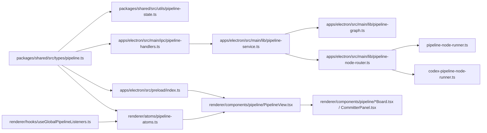
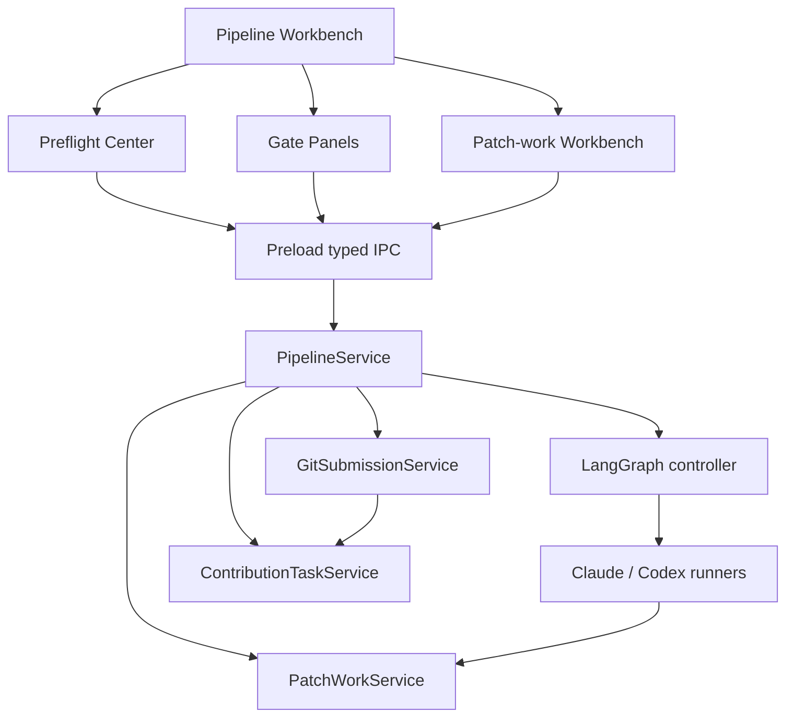
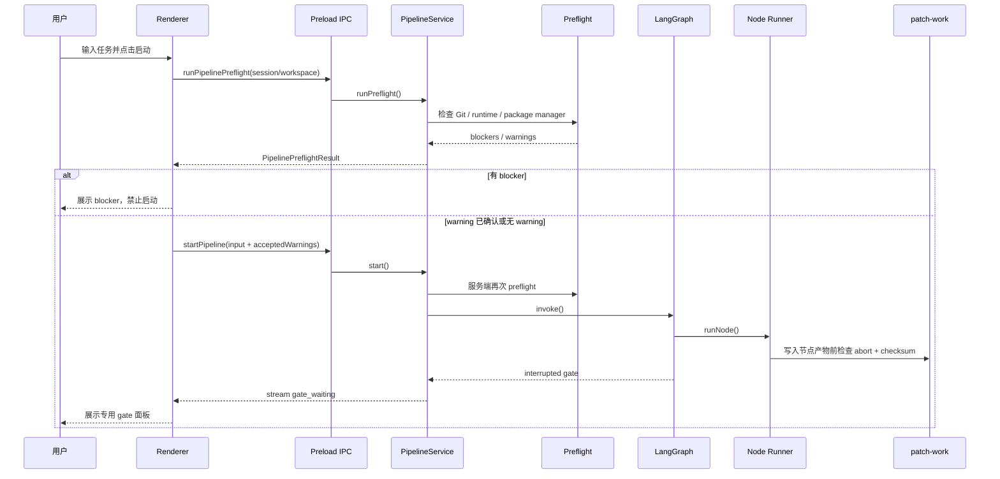
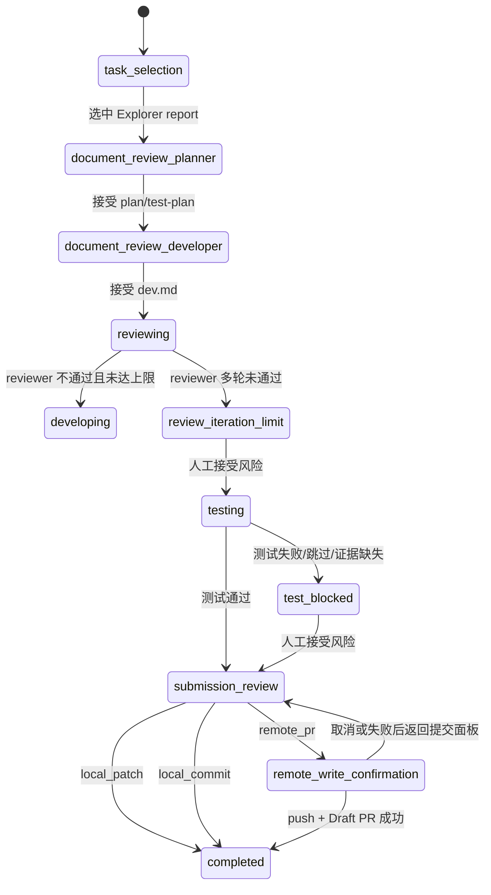

# Pipeline 模式 v1 优化方案

> 日期：2026-05-28
> 范围：当前仓库真实实现、Pipeline shared 契约、主进程服务、IPC / preload、Renderer 工作台、历史 v0 方案与 README 中已公开的 Pipeline v2 事实。
> 说明：本文中的 v1 指“本优化方案版本”，不是 `PipelineVersion = 1` 的旧会话协议。

## 结论摘要

当前 Pipeline 已经不是早期五节点草稿，而是默认新建 `PipelineVersion = 2` 的六阶段贡献流水线：`explorer -> planner -> developer -> reviewer -> tester -> committer`。后端已经具备 LangGraph interrupt / resume、Claude / Codex 混合路由、`patch-work` 固定文件、ContributionTask、本地 commit、远端 Draft PR 受控提交和 JSONL 可回放记录。前端也已经有 StageRail、Records、ExplorerTaskBoard、ReviewDocumentBoard、ReviewerIssueBoard、TesterResultBoard、CommitterPanel 和全局流式监听。

下一阶段不应该重做 Pipeline，而应该围绕“启动前确定性、审核体验、提交安全和可维护性”做收敛：

- 把已存在的主进程 `runPipelinePreflight()` 接入 IPC、Renderer 和 `PipelineService.start()` 服务端守卫。
- 把 `PipelineView` 中记录加载、patch-work 文档读取、gate action、preflight 和提交动作拆成小 hook / view model。
- 修正 v2 UI 细节漂移，例如 Records 阶段过滤和分组仍使用五节点顺序，导致 `committer` 可见性不足。
- 将 `submission_review`、本地 commit、远端写确认拆成更清晰的状态模型，避免“同一个 pending gate 里用 response.kind 模拟二次 gate”的语义不透明。
- 新增 Patch-work Document Workbench、Contribution Task Dashboard、PR Preview / GitHub API / existing PR update 等产品能力。

本轮二次完善后，本文更偏“实现蓝图”而不是纯分析文档。后续拆 PR 时可直接按 P0 / P1 / P2 优先级推进，每个阶段都保留独立验证和阶段提交。

### 二次细化重点

| 方向 | 本文补充的落地细节 |
|------|--------------------|
| 契约 | 明确新增 IPC、preload API、read model、run policy、submission plan 和 revision DTO 的字段边界。 |
| 后端 | 补充文件级改动路径、服务拆分边界、start 守卫、gate side effect 幂等、abort-before-side-effects 和 Git / remote 写控制。 |
| 前端 | 补充 Jotai atom、hook 拆分、组件职责、面板布局、按钮状态、错误态、空态和 a11y 约束。 |
| 新功能 | 将 Preflight Center、Document Workbench、Submission Plan、Contribution Dashboard、Workflow Profile、Report Export 都拆成 MVP、增强项和验收条件。 |
| 验证 | 补充单测矩阵、集成场景、fixture repo、smoke、打包验证、失败注入和不回归检查。 |

## 当前实现事实

### 后端主链路

| 层 | 当前实现 | 观察 |
|----|----------|------|
| shared 契约 | `packages/shared/src/types/pipeline.ts` | `PipelineVersion = 1 | 2`；节点已包含 `committer`；Gate kind 已包含 `task_selection`、`document_review`、`review_iteration_limit`、`test_blocked`、`submission_review`、`remote_write_confirmation`；Preflight 类型已存在。 |
| 状态回放 | `packages/shared/src/utils/pipeline-state.ts` | v1 approve 到 tester 结束，v2 tester approve 进入 committer，committer approve 后 completed。 |
| Graph | `apps/electron/src/main/lib/pipeline-graph.ts` | v2 已接入 developer 文档 gate、reviewer 自动回 developer、tester 风险 gate、committer submission gate。 |
| 节点路由 | `apps/electron/src/main/lib/pipeline-node-router.ts` | v1: explorer/planner/tester 走 Claude，developer/reviewer/committer 走 Codex；v2: explorer/planner 走 Claude，developer/reviewer/tester/committer 走 Codex。 |
| Claude runner | `pipeline-node-runner.ts` | 负责 explorer/planner 和 v1 tester；有结构化 schema、自然语言 fallback 和 v2 patch-work enrichment。 |
| Codex runner | `codex-pipeline-node-runner.ts` | 负责 v2 developer/reviewer/tester/committer；默认 SDK，可切 CLI；workspace-write 节点带 Git guard。 |
| Lifecycle | `pipeline-service.ts` | 统一 start / resume / respondGate / stop / state / recovery；创建 ContributionTask 和仓库内 `patch-work`；处理 gate side effect。 |
| patch-work | `pipeline-patch-work-service.ts` | 固定文件、revision、accepted revision、checksum、realpath / symlink 防护已经较完整。 |
| Git submission | `pipeline-git-submission-service.ts` | 受控 local commit、remote push + `gh pr create --draft`、operation id 幂等、`patch-work/**` 排除和脱敏均已存在。 |
| IPC | `pipeline-handlers.ts` + `preload/index.ts` | 已暴露 session、records、artifact、patch-work read、select task、start/resume/respond/stop/state/stream，但尚未暴露 repository preflight。 |

### 前端主链路

| 层 | 当前实现 | 观察 |
|----|----------|------|
| 默认入口 | `App.tsx`、`useCreateSession.ts`、`PipelineSidebar.tsx` | 新建 Pipeline 显式传 `CONTRIBUTION_PIPELINE_VERSION = 2`，v2 看板可从默认路径进入。 |
| Jotai 状态 | `pipeline-atoms.ts` | session list、state map、pending gate、stream error、record refresh、live output、Codex 渠道都集中在 atoms。 |
| 全局监听 | `useGlobalPipelineListeners.ts` | 在 renderer 顶层订阅 stream，避免切换页面丢事件，这是正确方向。 |
| 工作台 | `PipelineView.tsx` | 单组件承载记录加载、状态回填、preflight、patch-work 文档读取、gate action、stop/restart 和面板选择，规模偏大。 |
| 阶段轨道 | `PipelineStageRail` + `pipeline-display-model.ts` | 已按 version 展示 v1/v2 节点顺序，v2 包含 committer。 |
| 记录视图 | `PipelineRecords.tsx` + view models | 支持 artifacts/logs、搜索、lazy artifact、报告复制；但 filter/group ordering 仍使用五节点 `PIPELINE_NODE_ORDER`。 |
| Gate 面板 | Explorer / Review / Reviewer / Tester / Committer | 已是贡献工作流专用 UI，不再只是通用 gate card。提交面板支持 local patch、local commit、remote PR。 |
| Renderer preflight | `pipeline-preflight.ts` | 仅检查渠道、工作区和 Pipeline Codex 渠道是否可用，不检查 Git root、冲突、CLI、package manager、remote / gh。 |

### 当前文件级依赖图

Pipeline 的关键改动不能只改一个位置，推荐以后按下面的依赖图检查：



任何新增 Pipeline 能力，至少要回答四个问题：

1. shared 类型是否能表达这个状态，并且旧 JSONL replay 是否兼容。
2. 主进程是否有服务端复验，而不是只靠前端禁用按钮。
3. preload 是否只暴露必要白名单 API，Renderer 是否通过 Jotai 或局部 hook 管理状态。
4. records、ContributionTask event 和 patch-work manifest 是否能支持事后审计。

### 当前可复用能力清单

| 能力 | 可复用位置 | 后续用法 |
|------|------------|----------|
| 贡献任务 JSON + JSONL | `contribution-task-service.ts` | 作为 Dashboard、SubmissionPlan、Preflight history 的事实源。 |
| patch-work manifest / checksum | `pipeline-patch-work-service.ts` | 作为 Document Workbench、revision diff、approve 二次校验的事实源。 |
| Git submission guard | `pipeline-git-submission-service.ts` | 继续承担 local commit、remote PR、patch-work 排除和脱敏。 |
| Pipeline records tail/search | `PipelineRecords.tsx` + IPC | 继续用于日志、报告导出、定位错误；不要用它反推主状态。 |
| stream bus + global listener | `pipeline-stream-bus.ts` + `useGlobalPipelineListeners` | 继续处理运行中状态、live output 和 gate 到达。 |
| renderer preflight helper | `pipeline-preflight.ts` | 继续保留渠道/工作区检查，但要更名或并入新的 run preflight view model，避免和 repo preflight 混淆。 |

## 当前优势

1. **本地优先的事实源已经合理。** 会话索引、JSONL 记录、checkpoint、artifact、ContributionTask、patch-work 都是文件系统可检查的状态，不依赖本地数据库。
2. **高风险写操作已经从 Agent 自由执行中剥离。** 本地 commit 和远端 push / PR 都由 `pipeline-service` 在用户确认后执行，Codex 节点本身不能直接完成真实提交。
3. **patch-work 路径安全基础扎实。** 当前实现已经覆盖 symlink、reserved path、realpath containment、checksum freshness 和 accepted revision。
4. **Renderer 事件监听位置正确。** Pipeline stream 由全局 listener 写入 atoms，不随工作台组件卸载销毁。
5. **v1/v2 共存策略已经落地。** shared replay、graph、display model 都能区分旧会话与新贡献流水线。

## 主要问题与风险

### 1. Preflight 有类型和服务，但未进入产品主路径

`PipelinePreflightInput / Result` 和 `runPipelinePreflight()` 已经存在，能够检查 Git root、当前分支、remote、未提交变更、冲突、package manager、Claude CLI、Codex CLI 等信息。但目前：

- `PIPELINE_IPC_CHANNELS` 没有 `RUN_PREFLIGHT`。
- `pipeline-handlers.ts` / `preload/index.ts` 没有暴露 preflight API。
- `PipelineView` 启动前只调用 renderer `resolvePipelineRunConfig()`，只覆盖渠道和工作区。
- `PipelineService.start()` 没有在服务端再次调用 preflight 阻止冲突仓库或缺失运行时。

这会造成 README 中“启动前检查 preflight 提示”的产品承诺和实际 UI 行为不完全一致。

### 2. PipelineView 过宽，后续维护成本偏高

`PipelineView.tsx` 同时负责：

- session / state / pending gate 派生。
- records tail 全量追赶与 refresh。
- explorer reports 读取。
- patch-work 文档读取、loading、error map。
- preflight 错误展示。
- start / stop / restart / respond gate。
- 五类业务面板选择。

这些逻辑都合理，但放在一个组件里会让后续新增 Preflight Center、Document Workbench、Contribution Dashboard 和 PR Preview 时继续膨胀。

### 3. v2 committer 在记录视图中仍有可见性缺口

`PipelineStageRail` 已使用 `getPipelineNodeOrder(version)`，但 `PipelineRecords.tsx` 的 `STAGE_FILTERS` 和 `pipeline-record-view-model.ts` 的 group sort 仍基于五节点 `PIPELINE_NODE_ORDER`。结果是：

- 阶段过滤可能缺少 `committer`。
- artifacts group 排序无法稳定表达第六阶段。
- 用户从 StageRail 点击提交阶段时，Records 的筛选心智不一致。

### 4. 远端写确认的语义需要收敛

类型里存在 `remote_write_confirmation` gate，`PipelineGateCard` 也把它视为高风险 gate；但当前 Graph 只会为 committer 生成 `submission_review`。实际远端写由 `CommitterPanel` 在同一个 `submission_review` pending gate 下发送：

```text
kind: remote_write_confirmation
submissionMode: remote_pr
remoteWriteConfirmed: true
```

后端再用 `response.kind === 'remote_write_confirmation'` 验证。这个实现是安全的，但产品语义不够清晰：用户看到的是提交材料审核面板里的 checkbox，而不是一个独立、可回放、可恢复的“远端写二次确认”状态。

### 5. Artifact 目录与 patch-work 工作目录概念混在 UI 中

`openPipelineArtifactsDir()` 打开的是配置目录里的 Pipeline artifacts；而 v2 用户最关心的是目标仓库中的 `patch-work/`、`patch-set/changes.patch`、`commit.md`、`pr.md`。当前 UI 可读取这些文件正文，但缺少“打开 patch-work 目录 / 打开当前文档 / 打开 patch-set”的明确入口。

### 6. patch-work 文档审核仍偏只读

后端已经支持 revision、checksum、accepted revision，但 UI 目前主要是读取文档并用反馈重跑节点。缺少：

- revision diff。
- 当前版本 vs accepted 版本对比。
- 文档内锚点评论。
- 用户小修文档后生成新 revision，再让 Agent 继续。
- 审核通过前的 checksum 二次确认提示。

### 7. ContributionTask 状态没有成为一等 UI

后端已经维护 ContributionTask 和事件，但前端主要从 Pipeline state / records / gate 推导当前状态。用户无法直接看到：

- repository root、base branch、working branch。
- selected report、current gate、contribution mode。
- local commit / remote PR 操作历史。
- allowRemoteWrites 是否已授权。
- patch-work manifest 健康状态。

### 8. Stop / abort 的本地副作用边界需要持续硬化

已有经验记录要求：停止必须在写 `dev.md`、`review.md` 等本地副作用前检查 abort。Codex runner 已有较多前后检查；Claude runner 的 patch-work enrichment 也应统一套用“写任何本地文件前再读 signal”的防线，避免 stop 后仍落盘新 revision。

### 风险优先级与处理方式

| 风险 | 严重度 | 处理方式 | 验收信号 |
|------|--------|----------|----------|
| Preflight 未接主路径 | P0 | 新增 IPC/UI/start guard，服务端 blocker 必须阻断 | 冲突仓库、缺 Git root、缺必需 runtime 都不会进入 Graph。 |
| committer 记录不可见 | P0 | Records filter/group 使用 version-aware order | v2 能筛选“提交”，v1 不显示 committer。 |
| 远端确认语义不清晰 | P1 | 拆独立 `remote_write_confirmation` gate 或 pending operation | 远端写有独立 record、operation id、二次确认 UI。 |
| patch-work 与 artifact 入口混淆 | P1 | 新增 patch-work open API 和文档工作台 | 用户能打开仓库内 `patch-work/`，不误入 config artifact 目录。 |
| 文档审核只读且无 diff | P1 | 新增 revision read model 和 compare UI | 用户能看到 current / accepted revision 差异。 |
| Stop 后仍可能写本地文件 | P1 | 所有 enrichment 写入前调用 abort guard | 停止后 manifest 不新增 revision。 |
| ContributionTask 不可见 | P2 | 新增 dashboard read model | 用户能直接看到 repo、branch、mode、commit、PR。 |
| GitHub 集成依赖 `gh` | P2 | 增加 API path 和 existing PR update | 无 `gh` 时仍可通过 API 创建/更新 PR，前提是用户显式配置 token。 |

## 目标架构

目标不是引入新框架，而是在现有 service + IPC + Jotai 模式上拆清边界。



### 后端改造原则

- `PipelineService` 继续作为生命周期门面，但把 preflight、gate side effects、submission orchestration、patch-work read model 拆到独立 helper / domain service。
- 所有 Renderer 可触发的写操作必须在服务端复验，不信任前端按钮 disabled。
- 所有 gate side effect 必须幂等：operation id、gate id、checksum、accepted revision 都参与判断。
- 所有真实 Git / remote 写必须在 Agent runner 之外执行。
- `patch-work/**` 默认永远不进入 patch-set、commit、push 或 PR。

### 前端改造原则

- Jotai 继续持有跨组件全局状态；组件局部只保存表单输入、展开状态和短期 submitting 状态。
- `PipelineView` 降级为布局编排层，业务数据读取迁出到 hook。
- 每个 gate 面板只接收 view model 和 action，不直接理解 session list / atoms。
- Preflight、patch-work、submission plan 作为可刷新 read model，而不是从 records 文本反推。

### 运行主流程目标态



目标态的关键点：

- Renderer preflight 是用户体验，Service preflight 是安全边界。
- Graph 只表达流程，不直接执行本地 commit / push / PR。
- Runner 只生成产物或修改工作区，真实提交由 Service 的 submission orchestrator 执行。
- patch-work 是用户可审计工作目录，records 是事件日志，ContributionTask 是领域状态。

### Gate 状态目标态



这里推荐把 `remote_write_confirmation` 变成可观察状态，而不是只作为 `PipelineGateResponse.kind` 的验证字段。

## 数据契约建议

### 1. Preflight IPC

复用已有 shared 类型，新增 IPC 通道和 preload API：

```ts
interface PipelineRunPreflightInput extends PipelinePreflightInput {
  sessionId?: string
  workspaceId?: string
}
```

建议新增：

- `PIPELINE_IPC_CHANNELS.RUN_PREFLIGHT`
- `window.electronAPI.runPipelinePreflight(input)`
- `PipelineService.runPreflight(input)`

服务端 `start()` 中也要调用同一逻辑。Renderer preflight 负责提前解释和引导，服务端 preflight 负责最终阻断。

### 2. PipelineRunPolicy

用于明确一轮 Pipeline 的运行策略，避免 scattered boolean：

```ts
interface PipelineRunPolicy {
  version: PipelineVersion
  requireCleanWorktree: boolean
  requireClaudeCli: boolean
  requireCodexCli: boolean
  allowLocalCommit: boolean
  allowRemoteWrites: boolean
  maxReviewIterations: number
  submissionModeDefault: ContributionMode
}
```

第一阶段可以先只在 service 内部实现，不必立刻暴露设置 UI。

### 3. ContributionTaskSummary

新增面向 UI 的轻量 read model：

```ts
interface ContributionTaskSummary {
  taskId: string
  sessionId: string
  repositoryRoot: string
  patchWorkDir: string
  status: string
  selectedReportId?: string
  selectedTaskTitle?: string
  contributionMode: ContributionMode
  allowRemoteWrites: boolean
  currentGateId?: string
  baseBranch?: string
  workingBranch?: string
  localCommitHash?: string
  remotePrUrl?: string
  updatedAt: number
}
```

这个接口让 UI 不再从 records 或 stage output 拼贡献任务状态。

### 4. PatchWorkDocumentRevision

在现有 `PatchWorkManifest` 基础上补充文档历史读取：

```ts
interface PatchWorkDocumentRevision {
  relativePath: string
  revision: number
  checksum: string
  content: string
  createdByNode: PatchWorkNodeKind
  updatedAt: number
  accepted: boolean
}
```

新增 list/read revision API 后，ReviewDocumentBoard、TesterResultBoard、CommitterPanel 可以共享同一个 Document Workbench。

### 5. PipelineSubmissionPlan

把 committer 输出和 Git preflight 合成提交计划：

```ts
interface PipelineSubmissionPlan {
  sessionId: string
  mode: ContributionMode
  commitMessage: string
  prTitle: string
  baseBranch?: string
  headBranch?: string
  candidateFiles: string[]
  excludedFiles: string[]
  blockers: string[]
  warnings: string[]
  localCommit?: PipelineLocalCommitSummary
  remoteSubmission?: PipelineRemoteSubmissionSummary
}
```

这样 CommitterPanel 可以先展示“计划”，再执行“创建本地 commit”或“远端提交”。

### 6. 具体 IPC 增量清单

| IPC 常量 | 输入 | 输出 | 是否写状态 | 说明 |
|----------|------|------|------------|------|
| `RUN_PREFLIGHT` | `PipelineRunPreflightInput` | `PipelinePreflightResult` | 否，默认只读 | Renderer 启动前检查；可由 Service start 再调用。 |
| `GET_CONTRIBUTION_TASK_SUMMARY` | `{ sessionId }` | `ContributionTaskSummary` | 否 | Dashboard 使用，找不到 task 时返回可解释错误或 `null`。 |
| `GET_SUBMISSION_PLAN` | `{ sessionId }` | `PipelineSubmissionPlan` | 否 | CommitterPanel / PR Preview 使用。 |
| `LIST_PATCH_WORK_REVISIONS` | `{ sessionId, relativePath }` | `PatchWorkDocumentRevision[]` | 否 | Document Workbench revision selector。 |
| `READ_PATCH_WORK_REVISION` | `{ sessionId, relativePath, revision }` | `PatchWorkDocumentRevision` | 否 | 读取历史版本正文。 |
| `OPEN_PATCH_WORK_DIR` | `{ sessionId }` | `boolean` | 否 | 打开目标仓库内 `patch-work/`。 |
| `OPEN_PATCH_WORK_FILE` | `{ sessionId, relativePath }` | `boolean` | 否 | 打开单个文档或 patch-set 文件，必须复用路径安全校验。 |

首期 P0 可以只做 `RUN_PREFLIGHT`、`OPEN_PATCH_WORK_DIR` 和 Records v2 修复；其余契约可以先写类型和测试，再按阶段启用 UI。

### 7. 运行时字段校验规则

来自 IPC、JSONL 和 manifest 的数据不能只依赖 TypeScript 类型。新增服务入口要做运行时校验：

- `sessionId`、`taskId`、`gateId`：非空字符串；`taskId` 继续使用 `^[A-Za-z0-9_-]+$`。
- `relativePath`：必须是仓库内 `patch-work` 相对路径；拒绝绝对路径、`..`、Windows 绝对路径、reserved path、symlink。
- `revision`：正整数，必须存在于 manifest 或 revision 目录。
- `ContributionMode`：只能是 `local_patch | local_commit | remote_pr`。
- `PipelineVersion`：只接受 `1 | 2`，旧 session 缺失 version 时按 v1 replay。
- `acceptedWarningCodes`：只能包含 `PipelinePreflightIssueCode`，并写入 records / task event 方便审计。

### 8. 错误码建议

为了让前端展示更稳定，建议把常见错误从裸字符串收敛成 code + message：

| code | 使用场景 | UI 建议 |
|------|----------|---------|
| `pipeline_preflight_blocked` | start 前服务端 preflight 有 blocker | 展示 PreflightPanel 并聚焦 blocker。 |
| `patch_work_checksum_mismatch` | approve 时文件被外部修改 | 显示刷新 / 对比 / 重跑。 |
| `patch_work_path_unsafe` | 读写路径越界或 symlink | 显示安全错误，不提供继续按钮。 |
| `submission_requires_local_commit` | remote PR 前没有本地 commit | 引导先创建本地 commit。 |
| `remote_write_not_confirmed` | 缺少二次确认 | 打开远端写确认面板。 |
| `pipeline_aborted_before_side_effect` | stop 后写文件前中止 | 记录为 terminated，不显示为 node_failed。 |

第一阶段可以先在 service 内部用 `Error`，但文档和测试应按这些 code 设计，后续再接 TypedError。

## 后端优化方案

### Phase A: 接入 repository preflight 主路径

实现点：

1. 在 shared IPC 常量中加入 `RUN_PREFLIGHT`。
2. 在 `pipeline-handlers.ts` 中注册 handler，调用 `runPipelinePreflight()`。
3. 在 `preload/index.ts` 暴露 `runPipelinePreflight()`。
4. 在 `PipelineService.start()` 中解析 workspace session path 后执行服务端 preflight。
5. 将 blocker 写入 Pipeline record：`preflight_completed` 或 `error`，并同步 ContributionTask event。

服务端阻断建议：

- Git 不可用、不是 Git root、存在 conflict、Claude / Codex 必需运行时缺失：阻断启动。
- 未提交变更、remote 缺失、detached HEAD、package manager unknown：默认 warning，由用户确认后可继续。

文件级改动建议：

| 文件 | 改动 |
|------|------|
| `packages/shared/src/types/pipeline.ts` | 新增 `PipelineRunPreflightInput`、`PipelinePreflightAcknowledgement`，扩展 `PIPELINE_IPC_CHANNELS`。 |
| `apps/electron/src/main/lib/pipeline-preflight-service.ts` | 保持纯服务；补充 `github` runtime 检查是否按 profile 需要。 |
| `apps/electron/src/main/lib/pipeline-service.ts` | 新增 `runPreflight()`；`start()` 调用服务端 preflight 并写 records/task event。 |
| `apps/electron/src/main/ipc/pipeline-handlers.ts` | 注册 `RUN_PREFLIGHT` handler。 |
| `apps/electron/src/preload/index.ts` | 类型声明和 `electronAPI.runPipelinePreflight()`。 |
| `apps/electron/src/renderer/components/pipeline/PipelineView.tsx` | 首期可直接调用；后续迁到 `usePipelinePreflight()`。 |
| `apps/electron/src/renderer/components/pipeline/PipelinePreflightPanel.tsx` | 新增展示组件，按 blocker/warning/runtime 分组。 |

服务端 `start()` 伪流程：

```ts
async function start(input: PipelineStartInput, callbacks: PipelineServiceCallbacks): Promise<void> {
  const meta = requirePipelineSession(input.sessionId)
  const workspaceId = input.workspaceId ?? meta.workspaceId
  const repositoryRoot = resolvePipelineRepositoryRoot(meta, workspaceId)
  const preflight = await runPreflight({
    sessionId: meta.id,
    workspaceId,
    repositoryRoot,
    requireClaudeCli: true,
    requireCodexCli: meta.version === 2,
  })

  appendPreflightRecords(meta.id, preflight)
  appendPreflightContributionEvent(meta.id, preflight)

  if (!preflight.ok) {
    throw new Error('Pipeline preflight 未通过')
  }

  await invokeGraph()
}
```

注意点：

- Renderer 允许用户接受 warning，但 Service 必须重新计算 preflight，不能信任前端传回的 result。
- warning 接受只对当前 preflight fingerprint 有效。fingerprint 可由 `repositoryRoot + currentBranch + baseBranch + blockers/warnings code + runtime version` 生成。
- `requireCodexCli` 的语义要和当前 Codex SDK / CLI 后端一致：如果 SDK 模式能通过 API key 或本机 Codex auth 执行，就不应误报必须有 `codex` CLI；可以把 runtime kind 拆成 `codex-sdk-auth` 与 `codex-cli`。

### Phase B: 拆分 PipelineService 的领域函数

建议拆出：

- `pipeline-run-preflight-service.ts`：workspace -> repository root -> preflight result。
- `pipeline-gate-side-effect-service.ts`：task selection、document accept、tester accept、committer accept。
- `pipeline-submission-orchestrator.ts`：local patch / local commit / remote PR 三种 submission mode。
- `pipeline-read-model-service.ts`：ContributionTaskSummary、SubmissionPlan、PatchWorkDocumentRevision。

拆分目标不是换架构，而是让 `pipeline-service.ts` 保持生命周期门面，降低单文件认知负担。

拆分后的调用关系：

```text
PipelineService.start/resume/respondGate/stop
  -> PipelineRunPreflightService
  -> PipelineGraphController
  -> PipelineGateSideEffectService
       -> PatchWorkService
       -> ContributionTaskService
  -> PipelineSubmissionOrchestrator
       -> GitSubmissionService
       -> ContributionTaskService
  -> PipelineReadModelService
```

每个服务的边界：

| 服务 | 允许写 | 不允许做 |
|------|--------|----------|
| `PipelineRunPreflightService` | 可写 preflight artifact / event，首期也可只读 | 不启动 Graph，不修改 task 阶段。 |
| `PipelineGateSideEffectService` | 接受 patch-work 文档、更新 task status、写 task event | 不执行 git commit/push。 |
| `PipelineSubmissionOrchestrator` | 执行 local commit / remote PR、回填 committer output、写 event | 不跑模型，不修改非提交相关 patch-work。 |
| `PipelineReadModelService` | 默认只读 | 不改变 manifest、不 accept revision。 |

幂等要求：

- `select_task`：同一 `gateId + selectedReportId` 重复调用返回同一个 `selected-task.md` ref，不新增多份 selected task。
- `document_review approve`：同一 gate 重复 approve 不重复写 accepted event，只更新 acceptedRevision 缺失的文档。
- `local_commit`：继续使用 operation id；已成功的 operation 直接返回已有 commit summary。
- `remote_pr`：push 成功 PR 失败时保留 `pushed` 状态，重试只补 PR 创建，不重复 push。

### Phase C: 明确远端写二次确认

两种可选实现：

1. **真正独立 gate。** `submission_review` approve with `remote_pr` 后，Graph / service 生成 `remote_write_confirmation` pending gate；用户第二次确认后才执行 `git push` / `gh pr create`。
2. **同 gate 双阶段，但持久化 pending operation。** 保持当前 Graph 不变，但 service 创建 `remoteSubmissionPendingOperation` read model，UI 显示独立确认页，records 中写入独立 `gate_requested` / `gate_decision` 语义。

推荐第一种，原因是当前 shared 类型和 `PipelineGateCard` 已经有 `remote_write_confirmation` 概念，补齐 Graph / service 语义更一致。

独立 gate 的具体设计：

1. `submission_review` gate 中用户选择 `remote_pr` 时，Service 只接受 `commit.md` / `pr.md`，创建 `PipelineRemoteWritePlan`，状态仍不执行 push。
2. Graph 或 Service 生成 `remote_write_confirmation` gate，payload 包含 `operationId`、`remoteName`、`baseBranch`、`headBranch`、`commitHash`、`prTitle`、`sanitizedRemoteUrl`、`warnings`。
3. UI 展示二次确认面板，用户必须勾选风险项并点击“确认远端写”。
4. Service 复验 operation id、commit hash、remote base、head branch safety、`patch-work/**` tree/range，再执行 push / PR。
5. 成功后 `lastApprovedNode = committer`，session completed；失败时保留 pending gate 或回到 submission panel，具体取决于失败是否可重试。

推荐 record：

- `gate_requested`：`kind = remote_write_confirmation`。
- `gate_decision`：记录 action、operationId、remoteWriteConfirmed。
- `stage_artifact`：记录 remote submission result。
- `status_change`：成功 completed；失败 node_failed 或 waiting_human，取决于失败类型。

### Phase D: 统一 abort-before-side-effects

所有 runner enrichment 写本地文件前增加统一 helper：

```ts
function assertPipelineNotAborted(signal?: AbortSignal): void {
  if (signal?.aborted) {
    throw new Error('Pipeline 已停止，跳过本地副作用')
  }
}
```

覆盖点：

- explorer reports 写入前。
- planner `plan.md` / `test-plan.md` 写入前。
- developer `dev.md` 写入前。
- reviewer `review.md` 写入前。
- tester `result.md` / `patch-set/*` 写入前。
- committer `commit.md` / `pr.md` 写入前。

实现细节：

- helper 放在 `pipeline-runner-abort.ts` 或 `pipeline-node-runner.ts` 内部共享，Codex / Claude runner 都复用。
- 错误不要伪装成模型失败；Service 捕获后应把 session 设置为 `terminated` 或保留 stop 返回的状态。
- 如果模型已经返回但还未写 patch-work，stop 后应丢弃 enrichment，不发送 `node_complete`。
- 如果 patch-work 已写一部分，必须保证写入函数本身是原子的；manifest 更新必须在所有文件写完后发生，避免半成品被 accepted。

测试点：

- fake runner 在模型返回后、enrichment 前触发 abort，断言 manifest 无新增文件。
- tester 写 patch-set 多文件时中途 abort，断言没有 manifest 指向不存在或 checksum 不匹配的文件。
- stop IPC 返回 `terminated` 后，即使随后 runner promise resolve，也不能把状态改回 `waiting_human` 或 `completed`。

### Phase E: GitHub 集成增强

在现有 `gh pr create --draft` 基础上增加可选路径：

- GitHub API 创建 Draft PR，减少对 `gh` CLI 的依赖。
- 已有 PR 检测与更新。
- PR preview 页面：title、body、base/head、changed files、test evidence、risk。
- push 成功但 PR 创建失败时，提供“重试创建 PR”和“打开远端分支”。

保持原则：默认不自动远端写；所有 push / PR 仍必须由明确 gate 确认。

GitHub API 路径建议：

- 配置来源优先级：用户显式 GitHub token 配置 > `GH_TOKEN` / `GITHUB_TOKEN` 环境变量 > `gh` CLI auth；任何 token 不写入 records、diagnostics、event payload。
- API 只负责 PR 创建 / 更新；`git push` 仍由本地 Git 执行，除非未来引入 GitHub contents API，这不建议作为首期目标。
- existing PR 检测依据：`headOwner:headBranch + baseBranch + repository`，不是只按 title 匹配。
- PR body update 必须显示 diff preview，避免覆盖用户手动编辑内容。

错误处理：

| 失败 | 处理 |
|------|------|
| push 失败 | 不创建 PR；返回 submission_review 或 remote gate，保留错误脱敏。 |
| push 成功 PR 创建失败 | 记录 `pushed`，允许重试 PR 创建且 `skipPush = true`。 |
| PR 已存在 | 返回 existing PR URL，提示用户选择“更新现有 PR”或“打开 PR”。 |
| auth 失败 | 不打印 token；Preflight Center 标记 GitHub auth blocker。 |

### Phase F: Read Model 与导出报告

新增 `pipeline-read-model-service.ts` 后，不要让 Renderer 拼装复杂领域状态。建议提供：

- `getContributionTaskSummary(sessionId)`
- `getPipelineSubmissionPlan(sessionId)`
- `getPatchWorkDocumentIndex(sessionId)`
- `getPipelineExportReport(sessionId, options)`

导出报告可以使用 records + patch-work + task events 三类输入：

```text
PipelineExportReport
  - session meta
  - contribution task summary
  - selected task
  - accepted documents
  - review iterations
  - test evidence
  - patch-set summary
  - submission result
  - risk acceptance records
```

首期导出 Markdown 即可；后续再考虑 HTML / PDF。

## 前端优化方案

### 1. PipelineView 拆分

建议拆成以下 hook：

- `usePipelineSessionState(sessionId)`：合并 session meta、state map、pending gate、error、live output。
- `usePipelineRecords(sessionId)`：tail loading、refresh、focus request。
- `usePatchWorkDocuments(sessionId, refs)`：读取 patch-work 文件、loading、error、cache。
- `usePipelinePreflight(sessionId, workspaceId)`：运行 preflight、保存 result、生成 blocker/warning view model。
- `usePipelineGateActions(sessionId, pendingGate)`：approve、reject、rerun、select task、local commit、remote submit。
- `useContributionTaskSummary(sessionId)`：读取任务摘要和提交计划。

`PipelineView` 最终只做：

```text
Header
StageRail
PreflightPanel
FailureCard
Records
GateSidePanel
Composer
```

拆分优先级：

| 优先级 | hook / component | 从 `PipelineView` 迁出的逻辑 | 验收 |
|--------|------------------|------------------------------|------|
| 1 | `usePipelineRecords` | tail loading、cursor、refresh、focus request | session 切换不串 records；refresh 后不丢旧记录。 |
| 1 | `usePatchWorkDocuments` | refs -> content/loading/error map | 相同 checksum 不重复读取；session 切换清空旧 loading。 |
| 1 | `usePipelineGateActions` | respond/select/commit/remote submit action | 所有按钮错误能落到本面板，不污染全局 error。 |
| 2 | `usePipelinePreflight` | start 前 repo preflight、warning acknowledgement | blocker 禁止 start；warning 可记录后继续。 |
| 2 | `PipelineGateSidePanel` | 根据 pendingGate 选择具体 board | `PipelineView` 不再直接判断所有 gate kind。 |
| 3 | `useContributionTaskSummary` | task summary / submission plan read model | Dashboard 与 CommitterPanel 共享同一数据源。 |

组件职责建议：

```text
PipelineView
  只负责布局和组合
PipelineHeader
  只展示 session/state 摘要
PipelineStageRail
  只展示 version-aware stage 状态和 stage focus
PipelinePreflightPanel
  展示 repo/runtime 检查结果
PipelineRecords
  展示 artifacts/logs/search/live output
PipelineGateSidePanel
  分发到 ExplorerTaskBoard / ReviewDocumentBoard / TesterResultBoard / CommitterPanel
PipelineComposer
  输入新任务、stop/restart
```

UI 状态边界：

- 全局 atoms：session list、state map、pending gates、stream errors、live output、preflight result、task summary。
- hook 局部 state：loading、submitting、textarea、selected report、expanded record。
- 不要把 textarea feedback 写进 Jotai，除非需要跨页面恢复草稿。

### 2. Preflight Center

新增右侧或顶部 panel，展示：

- repository root。
- current branch / upstream / remote。
- worktree status。
- package manager。
- Claude / Codex / Git / gh 可用性。
- blockers 与 warnings。
- “继续并记录风险”按钮，用于非阻断 warning。
- “打开设置 / 打开仓库 / 查看详情”动作。

Jotai 可以新增：

```ts
pipelinePreflightResultAtom: Map<sessionId, PipelinePreflightResult>
pipelinePreflightOverrideAtom: Map<sessionId, { acceptedWarningCodes: string[] }>
```

展示分组建议：

| 分组 | 内容 | 交互 |
|------|------|------|
| Repository | root、branch、upstream、remote、dirty/conflict | 打开仓库、复制路径。 |
| Runtime | Git、Claude、Codex、GitHub CLI/API | 打开设置、刷新检查。 |
| Package Manager | bun/npm/pnpm/yarn/unknown | unknown 只 warning，不阻断。 |
| Blockers | 冲突、非 Git root、缺必需 runtime | 禁止启动，按钮 disabled。 |
| Warnings | dirty、detached、remote 缺失 | 用户可展开详情并“记录风险继续”。 |

交互细节：

- 首次打开 session 时不强制跑 preflight，避免频繁 shell 调用；点击启动时自动跑。
- preflight result 有 `updatedAt` 和 `fingerprint`，超过 60 秒或工作区变化后标记“需要刷新”。
- 用户接受 warning 后，启动按钮文案改为“已记录风险，继续启动”。
- blocker 出现时，Composer 仍可编辑任务，但启动按钮禁用。
- 渠道/工作区错误仍走 `pipeline-preflight.ts` 的设置跳转；repo/runtime preflight 走新 panel。

可访问性：

- blocker / warning 列表使用 `role="status"` 或 `aria-live="polite"`。
- 刷新检查按钮要有 loading 文案，不只旋转 icon。
- 路径长文本可复制但不应撑破侧栏，使用中间截断或换行。

### 3. 修正 Records v2 阶段过滤

需要把 `PipelineRecords.tsx` 和 `pipeline-record-view-model.ts` 改成按 session version 取 `getPipelineNodeOrder(version)`。

建议接口调整：

```ts
<PipelineRecords
  version={session?.version ?? state?.version}
  ...
/>
```

同时补测试：

- v2 filter 包含 `committer`。
- committer artifact group 排在 tester 后。
- v1 filter 不显示 committer。

实现细节：

- `STAGE_FILTERS` 从常量改成 `buildStageFilters(version)`。
- `STAGE_FILTER_INDEX` 从常量改成 memoized map。
- `buildPipelineRecordGroups(records, { version })` 接收 version；旧调用默认 v1，避免旧测试大面积变动。
- `pipeline-record-experience-model.ts` 中如果有 stage navigation / focus filter，也要按 `PipelineNodeKind` 全量支持 committer。
- Search API 类型 `PipelineRecordSearchStage = 'all' | 'task' | PipelineNodeKind` 已能表达 committer，后端 search 不一定要改；重点是前端展示列表。

回归风险：

- v1 老会话如果 records 中历史上没有 committer，不应出现空提交过滤项。
- v2 如果 state 丢失但 session.version 存在，应使用 session.version。
- 如果 session.version 也缺失，按 v1，兼容旧数据。

### 4. Patch-work Document Workbench

把当前各 panel 内联 `<pre>` 升级为共享文档工作台：

- 左侧文件列表：`selected-task.md`、`plan.md`、`test-plan.md`、`dev.md`、`review.md`、`result.md`、`patch-set/*`、`commit.md`、`pr.md`。
- 主区 Markdown / diff / JSON 渲染。
- revision selector。
- accepted revision badge。
- checksum badge。
- compare current vs accepted。
- 打开文件 / 打开 patch-work 目录。

首期只读即可，第二期再加入轻量编辑和文档内评论。

MVP 布局：

```text
PatchWorkDocumentWorkbench
  Header: 当前文件名 / revision / checksum / accepted badge / 打开文件
  Left: 文件树或分组列表
  Main: MarkdownRenderer / DiffViewer / JsonViewer / PlainText
  Right(optional): revision list / compare controls / metadata
```

文件分组：

| 分组 | 文件 |
|------|------|
| 任务 | `selected-task.md`、`explorer-reports/*.md` |
| 方案 | `plan.md`、`test-plan.md` |
| 开发 | `dev.md` |
| 审查 | `review.md` |
| 测试 | `result.md`、`patch-set/test-evidence.json` |
| 补丁 | `patch-set/changes.patch`、`patch-set/changed-files.json`、`patch-set/diff-summary.md` |
| 提交 | `commit.md`、`pr.md` |

渲染规则：

- `.md`：复用现有 Markdown / AI elements 渲染能力，代码块仍用 shared UI。
- `.patch`：使用 diff 样式，文件头、hunk、加减行分色。
- `.json`：格式化展示，解析失败时显示原文和错误。
- 其他：纯文本。

安全与一致性：

- 读取文件始终通过 `readPipelinePatchWorkFile` 或新的 revision IPC，不允许 Renderer 拼本地路径读文件。
- approve 前服务端重新检查 checksum；UI 的 checksum badge 只是提示。
- 外部文件变化后，Workbench 显示“已变化，需要刷新”，不要自动接受最新内容。

### 5. CommitterPanel 改为提交计划 UI

当前 CommitterPanel 已能展示提交材料、候选文件、本地 commit 和远端 PR 结果。下一步应把它拆成三个明确动作区：

- **保存材料**：接受 `commit.md` / `pr.md`，不写 Git。
- **创建本地 commit**：展示 candidate files、excluded files、commit message、branch，确认后执行。
- **创建 Draft PR**：展示 remote preflight、base/head、PR preview、二次 gate 后执行。

远端写确认不应只是 checkbox；至少要有单独的确认状态、operation id、风险列表和可回放 record。

三段式 UI 细节：

| 区域 | 主要信息 | 主按钮 | 禁用条件 |
|------|----------|--------|----------|
| 保存材料 | `commit.md`、`pr.md`、checksum、blockers、risks | 仅保存材料并完成 | 缺文档、checksum 缺失、blocker、读取失败。 |
| 本地 commit | commit message、candidate files、excluded files、branch、dirty status | 创建本地 commit | 提交材料未接受、已有 commit、候选文件为空、`patch-work/**` staged。 |
| Draft PR | remote、base/head、commit hash、PR title/body、remote preflight | 进入远端写确认 | 没有 local commit、remote blocker、已创建 PR。 |

面板需要明确展示：

- `operationId`，至少在 debug/details 中可复制。
- `patch-work/**` 默认排除。
- 本地 commit hash。
- PR URL 或失败原因。
- push 成功但 PR 失败时的恢复按钮。

按钮行为：

- “仅保存材料”只走 `submissionMode: local_patch`。
- “创建本地 commit”只走 `submissionMode: local_commit`。
- “推送并创建 Draft PR”不直接执行远端写，而是进入独立确认或 pending operation。

### 6. Contribution Task Dashboard

在 Pipeline 右侧或 Header 下增加任务摘要：

- 任务标题与 selected explorer report。
- 当前阶段与当前 gate。
- repository / branch / mode。
- patch-work 健康状态。
- local commit hash。
- remote PR URL。
- 最近事件。

这个 dashboard 使用 `ContributionTaskSummary`，不从 Records 文本提取。

Dashboard 字段布局：

| 区块 | 字段 |
|------|------|
| 任务 | selected task title、selected report id、task status、current gate。 |
| 仓库 | repository root、base branch、working branch、base commit、dirty/conflict 状态。 |
| 产物 | patch-work dir、manifest updatedAt、accepted docs count、latest revision count。 |
| 提交 | contribution mode、local commit hash、remote PR URL、allowRemoteWrites。 |
| 审计 | 最近 5 条 ContributionTask event。 |

刷新策略：

- gate 到达、gate resolved、node_complete、local commit / remote submission 后刷新。
- 用户点击 dashboard 刷新时重新读取 task summary 和 manifest。
- 读取失败不应阻断 records 展示，只在 dashboard 显示错误。

### 7. Settings 与 Workflow Profile

设置页不建议一开始就暴露所有 policy。首期可以在 Pipeline 设置或 Agent 设置中只暴露：

- Pipeline Codex 渠道选择。
- 默认贡献模式：`draft-only` / `local commit` / `remote PR`。
- 远端写默认关闭；开启后仍需要每次二次确认。
- Review iteration 上限，默认 3。

状态管理继续使用 Jotai；持久化走现有 settings service / JSON 配置，不引入 localStorage 或数据库。

## 新增功能建议

### 功能 1: Repository Preflight Center

目标：启动前和提交前都能明确知道仓库是否适合运行。

实现：

- 主进程复用 `runPipelinePreflight()`。
- Renderer 在 start 前自动跑。
- 服务端 start 再跑一次，避免 UI 绕过。
- 提交前 remote preflight 合并到 SubmissionPlan。

验收：

- 冲突仓库不能启动 Pipeline。
- 缺少 Codex runtime 时 v2 不能进入 developer。
- 未提交变更显示 warning 并进入 records。

MVP 范围：

- 只读检查，不自动修复。
- 覆盖 Git root、conflict、dirty、branch、remote、package manager、Claude runtime、Codex runtime。
- 支持 warning acknowledgement，但 blocker 不允许继续。

增强范围：

- 对 dirty worktree 支持“查看变更文件”。
- 对 remote missing 提供“继续 local patch only”建议。
- 对 Codex auth 缺失提供“打开渠道设置 / 使用本机 Codex 登录 / 使用 CODEX_API_KEY”的分支提示。

### 功能 2: Patch-work Document Workbench

目标：让 Pipeline 的核心产物从“隐藏文件”变成“可审计工作台”。

实现：

- 新增 list/read revisions IPC。
- 复用 manifest checksum。
- 统一渲染 Markdown、diff、JSON。
- 支持打开 patch-work 目录。

验收：

- 用户可对比 `dev.md` 第 n 版和 accepted 版。
- checksum 缺失或文件被改动时禁止 approve。
- `patch-set/changes.patch` 可独立查看。

MVP 范围：

- 文件列表、当前文档阅读、revision list、current vs accepted diff、打开 patch-work 目录。
- 不提供编辑，避免先引入文档写入冲突。

增强范围：

- 用户局部编辑文档并保存为 `createdByNode: preflight` 或 `createdByNode: user`。如果要引入 `user`，shared 类型需扩展 `PatchWorkNodeKind`。
- 文档评论和锚点反馈：反馈可以绑定到行号 / heading，再发送给 Agent。
- 文档模板：`plan.md`、`dev.md`、`result.md`、`pr.md` 可有统一章节结构。

### 功能 3: Submission Plan 与 PR Preview

目标：提交前先展示完整计划，避免用户在按钮文案里猜测真实动作。

实现：

- 后端生成 `PipelineSubmissionPlan`。
- UI 展示 candidate files、excluded files、commit message、PR body。
- 远端 PR 支持 preview。
- 后续可接 GitHub API 或 existing PR update。

验收：

- `patch-work/**` 永远出现在 excluded files。
- local commit 前能看到将 stage 的文件列表。
- remote PR 前能看到 base/head、remote、PR title/body。

MVP 范围：

- 只基于当前 local commit / remote preflight / committer output 生成计划。
- PR preview 只读，用户要修改仍通过反馈让 committer 重跑或手改 patch-work 后刷新。

增强范围：

- PR body 可在 UI 中编辑并保存为新 revision。
- 支持 existing PR update。
- 支持关联 issue、labels、reviewers、draft/ready 状态切换。

### 功能 4: Workflow Profile

目标：为不同贡献场景提供运行策略，而不是把所有行为写死。

可选 profile：

- `draft-only`：只生成 patch-set、commit.md、pr.md。
- `local-commit`：允许受控本地 commit。
- `remote-pr`：允许二次确认后远端 Draft PR。
- `review-heavy`：提高 reviewer max iteration，适合大改动。

首期可做内部 `PipelineRunPolicy`，不急着做设置页。

Profile 语义：

| Profile | 行为 |
|---------|------|
| `draft-only` | 只生成 patch-set、commit.md、pr.md；不会创建 commit 或 PR。 |
| `local-commit` | 允许用户在 committer gate 中创建本地 commit；远端写仍关闭。 |
| `remote-pr` | 允许在本地 commit 后进入远端写确认；仍默认 Draft PR。 |
| `review-heavy` | reviewer 上限提高，tester 前必须有更严格 review 通过记录。 |

实现建议：

- `PipelineRunPolicy` 随 session 创建时落入 meta 或 task payload，避免运行中配置改变影响旧 session。
- Profile 只改变 gate 可选动作和 preflight 要求，不改变基础安全边界。

### 功能 5: Pipeline Report Export

目标：一键导出贡献过程报告，方便开源协作或问题复盘。

内容：

- 用户任务。
- selected report。
- plan/test-plan/dev/review/result 摘要。
- patch-set 统计。
- 测试证据。
- commit / PR 结果。
- 风险接受记录。

可复用 `PipelineRecords` 现有 Markdown report，但补上 patch-work 和 contribution task read model。

报告结构建议：

```markdown
# Pipeline 贡献报告

## 任务
## 仓库与分支
## Explorer 选择
## Planner 方案
## Developer 实现说明
## Reviewer 迭代
## Tester 证据
## Patch-set 摘要
## Commit / PR
## 人工风险接受记录
## 原始事件索引
```

导出范围：

- 默认导出 Markdown。
- 可选包含完整文档正文。
- 不导出 secret、credentialed remote URL、auth headers。

### 功能 6: 失败恢复与继续运行

目标：把“失败了只能看错误”升级为“可判断是否能恢复”。

实现：

- node_failed 时读取 latest checkpoint、pending gate、ContributionTask status 和 patch-work manifest。
- 区分可恢复失败：模型 JSON 解析失败、PR 创建失败、读取文档失败、测试阻塞。
- 区分不可自动恢复失败：Git conflict、patch-work path unsafe、checksum mismatch、运行时缺失。

验收：

- PR 创建失败但 push 成功时，UI 显示“重试创建 PR”，且不会重复 push。
- checksum mismatch 时，UI 显示“刷新文档 / 重跑节点”，而不是只显示通用错误。
- runtime 缺失时，UI 直接跳到设置或 preflight panel。

### 功能 7: 节点重跑策略

目标：让用户理解重跑会影响哪些产物。

规则建议：

| 重跑节点 | 影响 |
|----------|------|
| explorer | 新增 explorer report revision，不自动清空已选任务，除非用户重新选择。 |
| planner | 新增 `plan.md` / `test-plan.md` revision，旧 accepted revision 保留。 |
| developer | 新增 `dev.md` revision，可能修改工作区代码。 |
| reviewer | 新增 `review.md` revision，不直接改代码。 |
| tester | 新增 `result.md` 和 `patch-set/*` revision，可能修改代码。 |
| committer | 新增 `commit.md` / `pr.md` revision，不直接写 Git。 |

UI 在 rerun 前应提示“会新增 revision，不会删除旧 accepted revision”。

## 推荐分阶段路线

### Phase 0: 清理与对齐

- 修正 Records v2 committer filter / group。
- 为 `openPipelineArtifactsDir` 增加 `openPipelinePatchWorkDir`，避免概念混淆。
- 检查 shared 类型中历史注释和 obsolete 字段说明。
- 更新相关单测。

完成定义：

- v2 Records filter 显示 explorer/planner/developer/reviewer/tester/committer。
- v1 Records filter 仍保持五阶段。
- Tester / Committer 面板能打开 repo 内 `patch-work/`。
- 不改 Graph、不改 runner、不改提交逻辑。

### Phase 1: Preflight 主路径

- 新增 preflight IPC / preload。
- Renderer 加 PreflightPanel。
- `PipelineService.start()` 服务端阻断 blocker。
- records / ContributionTask event 持久化 preflight 结果。

完成定义：

- 缺 Git root / conflict / 缺必需 runtime 会在 Service start 阶段阻断。
- Renderer 能展示 blockers/warnings/runtime status。
- warning acknowledgement 写入 records 或 task event。
- 渠道/工作区错误仍能跳转设置页。

### Phase 2: PipelineView 拆分

- 抽 `usePipelineRecords`、`usePatchWorkDocuments`、`usePipelineGateActions`。
- 保持 UI 行为不变，降低后续新增功能风险。
- 给 hook view model 补单测。

完成定义：

- `PipelineView.tsx` 不再直接包含 records tail loading 和 patch-work read map 的主体逻辑。
- 所有现有 gate 面板行为不变。
- session 切换、stop、restart、gate respond 的现有测试通过。

### Phase 3: Patch-work Workbench

- 新增 revision read model。
- 替换 Planner / Developer / Tester / Committer 面板中的重复文档展示。
- 加 compare current vs accepted。

完成定义：

- 所有文档读取通过统一组件。
- 能查看 revision 列表和 accepted badge。
- checksum mismatch 有明确提示。
- `changes.patch` 有 diff 视图。

### Phase 4: Contribution Dashboard 与 Submission Plan

- 新增 ContributionTaskSummary IPC。
- 新增 SubmissionPlan IPC。
- CommitterPanel 改为三段提交计划。
- 本地 commit / remote PR 的 result 统一展示。

完成定义：

- Dashboard 显示 task、repo、branch、mode、patch-work、commit、PR 状态。
- CommitterPanel 不再直接从 tester/committer output 零散拼提交计划。
- local patch / local commit / remote PR 三个动作分区清晰。

### Phase 5: 远端集成增强

- 独立 `remote_write_confirmation` gate 或持久化 pending operation。
- GitHub API PR 创建路径。
- existing PR 检测 / 更新。
- push success / PR failure 的恢复 UI。

完成定义：

- 远端写有独立确认状态和 records。
- push / PR 任一失败都能脱敏展示并可判断是否可重试。
- existing PR 不会被静默覆盖。

### Phase 6: 真实端到端验收

- 准备 fixture repo。
- 跑 draft-only、local commit、remote PR 三条 smoke。
- 打包后验证 Pipeline 主路径。
- 记录所有未覆盖平台和真实凭证前提。

完成定义：

- fixture repo 里 draft-only 不产生 commit。
- local commit 只提交候选文件且不包含 `patch-work/**`。
- remote PR 创建 Draft PR，并能从 UI 打开 URL。
- packaged app 能完成至少 draft-only 和 local commit smoke。

### 阶段提交建议

每个 Phase 完成后独立提交，提交范围只包含该阶段相关文件。文档阶段和实现阶段也应分开提交，避免方案改动与代码行为混在一起。提交前至少运行对应阶段的聚焦测试和 `git diff --check`。

## BDD 验收场景

### 场景 1: 冲突仓库阻断启动

```gherkin
Given 用户选择的 Pipeline 工作区存在 Git conflict
When 用户点击启动 Pipeline
Then Renderer 显示 Preflight blocker
And PipelineService.start 不调用 LangGraph
And records 写入 preflight 失败摘要
```

### 场景 2: v2 Records 显示 committer

```gherkin
Given 当前会话 version 为 2
And records 中存在 committer stage_artifact
When 用户打开 PipelineRecords 阶段过滤
Then 过滤项包含“提交”
And committer 产物分组排在 tester 之后
```

### 场景 3: 文档 checksum 变化阻止 approve

```gherkin
Given planner 已生成 plan.md 和 test-plan.md
And 用户或外部进程修改了 plan.md 正文
When 用户点击接受方案
Then 服务端校验 checksum 失败
And gate 保持等待人工审核
And UI 展示需要刷新或重跑的提示
```

### 场景 4: 远端 PR 必须二次确认

```gherkin
Given committer 已生成 commit.md / pr.md
And 用户已创建本地 commit
When 用户选择创建 Draft PR
Then UI 展示独立远端写确认
And 未确认前不会执行 git push
When 用户确认远端写
Then 服务端校验 operation id、remote、base/head、patch-work tree/range
And 通过后才执行 push 和 PR 创建
```

### 场景 5: Stop 后不再写 patch-work

```gherkin
Given developer 节点正在运行
When 用户点击停止 Pipeline
Then runner 收到 abort signal
And 在写 dev.md 前再次检查 abort
And patch-work manifest 不新增停止后的 developer revision
```

### 场景 6: Preflight warning 可审计继续

```gherkin
Given 当前仓库有未提交变更但没有 Git conflict
When 用户启动 Pipeline
Then PreflightPanel 显示 dirty worktree warning
And 启动按钮要求用户确认记录风险
When 用户确认继续
Then PipelineService.start 再次执行 preflight
And records 和 ContributionTask event 记录 accepted warning code
And Pipeline 进入 explorer
```

### 场景 7: Patch-work Workbench 显示 revision diff

```gherkin
Given developer 已生成 dev.md 第 1 版并被接受
And 用户要求修改后生成 dev.md 第 2 版
When 用户打开 Patch-work Workbench
Then 左侧文件列表显示 dev.md
And revision selector 包含第 1 版和第 2 版
And 用户可以对比当前版本与 accepted 版本
```

### 场景 8: Local commit 不包含 patch-work

```gherkin
Given committer 已生成 commit.md 和 pr.md
And patch-set 中包含源码文件变更
When 用户点击创建本地 commit
Then 服务端使用 literal pathspec staging
And git index 中不得包含 patch-work/**
And 创建成功后 ContributionTask event 记录 commit hash 和 excluded files
```

### 场景 9: PR 创建失败后可恢复

```gherkin
Given 本地 commit 已创建
And git push 成功但 gh pr create 失败
When 用户回到 CommitterPanel
Then UI 显示远端分支已推送但 PR 创建失败
And 用户可以重试创建 PR
And 重试时 skipPush 为 true
```

### 场景 10: 旧 v1 会话保持兼容

```gherkin
Given 一个没有 version 字段的历史 Pipeline 会话
When 用户打开该会话
Then StageRail 显示五节点顺序
And Records 阶段过滤不显示 committer
And tester approve 后仍按旧流程 completed
```

## 验证计划

文档方案落地为代码时，建议每个阶段至少运行：

```bash
bun test apps/electron/src/main/lib/pipeline-graph.test.ts apps/electron/src/main/lib/pipeline-preflight-service.test.ts apps/electron/src/main/lib/pipeline-service.test.ts apps/electron/src/main/lib/codex-pipeline-node-runner.test.ts apps/electron/src/main/lib/pipeline-git-submission-service.test.ts
```

```bash
bun test apps/electron/src/renderer/components/pipeline/pipeline-preflight.test.ts apps/electron/src/renderer/components/pipeline/pipeline-display-model.test.ts apps/electron/src/renderer/components/pipeline/PipelineRecords.test.ts apps/electron/src/renderer/atoms/pipeline-atoms.test.ts
```

```bash
bun run --filter='@codeinsights/electron' typecheck
git diff --check -- apps/electron packages/shared docs/improve/pipeline tasks/todo.md
```

文档本身的验证：

```bash
git diff --check -- docs/improve/pipeline/v1 tasks/todo.md
test -f docs/improve/pipeline/v1/2026-05-28-pipeline-mode-optimization-plan.md
```

### 测试矩阵

| 层 | 必测文件 | 覆盖点 |
|----|----------|--------|
| shared replay | `packages/shared/src/utils/pipeline-state.test.ts` | v1/v2 状态分支、committer terminal、remote gate replay。 |
| graph | `pipeline-graph.test.ts` | gate 顺序、review loop、tester -> committer、remote confirmation。 |
| preflight | `pipeline-preflight-service.test.ts` | Git root、conflict、dirty、runtime missing、package manager unknown。 |
| patch-work | `pipeline-patch-work-service.test.ts` | path safety、revision、checksum、accepted revision、symlink。 |
| contribution task | `contribution-task-service.test.ts` | task/event schema、invalid JSONL line 跳过、status 更新。 |
| service | `pipeline-service.test.ts` | start guard、gate side effects、stop、pending gate recovery。 |
| Codex runner | `codex-pipeline-node-runner.test.ts` | Git command guard、abort before enrichment、patch-work exclude。 |
| Git submission | `pipeline-git-submission-service.test.ts` | local commit、remote PR、patch-work tree/range、脱敏、operation id。 |
| renderer display | `pipeline-display-model.test.ts` | v1/v2 stage order、status tone。 |
| renderer records | `PipelineRecords.test.ts`、`pipeline-record-view-model.test.ts` | committer filter/group、search、report export。 |
| renderer preflight | `pipeline-preflight.test.ts` + 新 panel 测试 | channel/workspace/repo preflight error、warning acknowledgement。 |
| gate panels | `ExplorerTaskBoard` / `ReviewDocumentBoard` / `TesterResultBoard` / `CommitterPanel` tests | button disabled、feedback required、document missing/checksum missing、submission plan。 |

### Fixture repo 设计

至少准备四类临时仓库：

1. **clean repo**：有 `package.json` / `bun.lock`，无 dirty，适合 happy path。
2. **dirty repo**：有未提交变更，验证 warning acknowledgement。
3. **conflict repo**：有冲突状态，验证 blocker。
4. **remote repo fixture**：本地 bare remote + working repo，验证 push / draft PR 前置逻辑；真实 GitHub PR 仍需要 gated smoke。

fixture 要避免依赖开发机全局 Git 配置。commit author、default branch、remote URL 都在测试内显式设置。

### Smoke 分层

| Smoke | 是否需要真实模型 | 目标 |
|-------|------------------|------|
| preflight smoke | 否 | 验证 IPC 到 main service，展示 repo/runtime 结果。 |
| draft-only pipeline smoke | 可用 fake runner | 验证六节点 gate 和 patch-work read model。 |
| local commit smoke | 可用 fake runner | 验证受控 staging 和 commit result。 |
| remote PR smoke | 需要真实 GitHub / gh 或 API token | 仅在用户明确提供凭证或 CI secret 时运行。 |
| packaged smoke | 可用 fake runner | 验证打包后 preload IPC、patch-work、local commit 主路径。 |

### 不回归检查

- v1 老会话打开、记录回放、tester completed 不变。
- Chat 隐藏回退不受 Pipeline IPC 扩展影响。
- Agent runtime 的全局 listener 不因 Pipeline listener 改动而重复订阅。
- `patch-work/**` 不进入默认 commit/push/PR。
- 错误消息和 logs 不包含 token、credentialed URL、Authorization header。

## 迁移与兼容策略

### 旧会话兼容

- 没有 `version` 的 session 继续按 v1 处理。
- v1 session 不创建 ContributionTaskSummary，Dashboard 显示“旧会话无贡献任务状态”即可。
- v1 session 不显示 committer filter，不显示 remote PR 相关入口。
- 旧 records 中没有 preflight record，不需要回填；只从新版本开始记录。

### patch-work manifest 兼容

- `PatchWorkManifest.version` 当前是 1；新增 revision read API 不必立刻提升 manifest version，只要 revision 数据能从现有 files / checksums 推导。
- 如果未来新增 `createdByNode: user`，需要提升 shared 类型，并为旧 manifest 默认映射到原节点。
- 任何 manifest schema 变化都要保留读旧写新策略，不能让历史 session 打不开。

### ContributionTask 兼容

- 新增 summary 字段时优先作为 read model 推导，不直接改 `ContributionTask` 存储结构。
- 必须新增存储字段时，`listContributionTasks()` 读取旧 task 要填默认值。
- 损坏 JSONL event 继续跳过并 `console.warn`，不要让一个坏 event 阻断整个 session。

### Settings 兼容

- Workflow Profile 初期可以只作为 session/task 内部 policy，不写全局设置。
- 如果写入 settings，默认值必须等价当前行为：v2 默认六节点，远端写默认关闭，review iteration 默认 3。
- 不使用 localStorage；沿用主进程 settings JSON。

### 文档同步边界

实现方案阶段不主动修改根 `README.md` / `AGENTS.md`。当行为真正落地并经过验证后，再向用户确认是否同步公开文档。

## 不建议做的事

- 不建议把 Pipeline 改成本地数据库方案；当前文件系统事实源更符合项目开源、本地优先的方向。
- 不建议让 Codex / Claude 节点自己执行真实 commit / push / PR；高风险写必须继续由 service + gate 控制。
- 不建议先做大规模 UI 重写；应先修正 preflight、records、patch-work workbench 这些可验证问题。
- 不建议默认把 remote PR 设为一键自动动作；远端写必须保持显式二次确认。
- 不建议为了新增功能修改 README / AGENTS，除非用户明确允许同步公开文档。

## 优先级清单

| 优先级 | 项目 | 理由 |
|--------|------|------|
| P0 | 接入 repository preflight IPC / UI / start guard | 已有服务未接主路径，是启动可靠性最大缺口。 |
| P0 | 修复 Records v2 committer filter / group | 小改动，高可见性，直接影响六阶段完整体验。 |
| P1 | PipelineView hook 拆分 | 为后续功能降低耦合，避免继续堆大组件。 |
| P1 | Patch-work Document Workbench | 提升核心产物审核体验，复用已有 revision/checksum 能力。 |
| P1 | 独立远端写确认语义 | 让高风险动作更清晰、更可回放。 |
| P2 | ContributionTask Dashboard | 提升状态透明度，减少从 records 推导状态。 |
| P2 | PR Preview / GitHub API / existing PR update | 属于远端协作增强，依赖前面 submission plan 稳定后再做。 |

## 最小可交付切片

如果下一轮只做一个小版本，推荐范围：

1. 新增 `RUN_PREFLIGHT` IPC / preload / service 方法。
2. `PipelineView` 启动前显示 PreflightPanel，blocker 禁止启动，warning 可继续。
3. `PipelineService.start()` 服务端复验 blocker。
4. 修复 `PipelineRecords` 和 record group 对 v2 committer 的过滤与排序。
5. 新增 `openPipelinePatchWorkDir`，在 Tester / Committer 面板提供入口。
6. 补主进程 preflight、renderer preflight、records v2 committer 单测。

这个切片不改变 Agent / Codex 执行逻辑，风险低，但能明显提升 Pipeline 的可靠性和可见性。

### 最小切片文件清单

| 文件 | 预期变更 |
|------|----------|
| `packages/shared/src/types/pipeline.ts` | 新增 `RUN_PREFLIGHT` IPC 常量和可选 input 类型。 |
| `apps/electron/src/main/ipc/pipeline-handlers.ts` | 注册 `RUN_PREFLIGHT` 和 `OPEN_PATCH_WORK_DIR`。 |
| `apps/electron/src/preload/index.ts` | 暴露 `runPipelinePreflight`、`openPipelinePatchWorkDir`。 |
| `apps/electron/src/main/lib/pipeline-service.ts` | 新增 `runPreflight()`、`getPatchWorkDir()`；`start()` 服务端复验 blocker。 |
| `apps/electron/src/renderer/atoms/pipeline-atoms.ts` | 新增 preflight result / acknowledgement atoms。 |
| `apps/electron/src/renderer/components/pipeline/PipelinePreflightPanel.tsx` | 新增 preflight 展示组件。 |
| `apps/electron/src/renderer/components/pipeline/PipelineView.tsx` | 接入 preflight panel、启动前检查、传 `version` 给 Records。 |
| `apps/electron/src/renderer/components/pipeline/PipelineRecords.tsx` | 版本化 filter。 |
| `apps/electron/src/renderer/components/pipeline/pipeline-record-view-model.ts` | 版本化 group sort。 |
| `apps/electron/src/renderer/components/pipeline/TesterResultBoard.tsx` / `CommitterPanel.tsx` | 增加打开 patch-work 目录入口。 |

### 最小切片验收命令

```bash
bun test apps/electron/src/main/lib/pipeline-preflight-service.test.ts apps/electron/src/main/lib/pipeline-service.test.ts
```

```bash
bun test apps/electron/src/renderer/components/pipeline/pipeline-preflight.test.ts apps/electron/src/renderer/components/pipeline/PipelineRecords.test.ts apps/electron/src/renderer/components/pipeline/pipeline-record-view-model.test.ts
```

```bash
bun run --filter='@codeinsights/electron' typecheck
git diff --check -- packages/shared apps/electron tasks/todo.md
```

### 下一轮实现顺序

1. 先写 renderer / shared 测试，锁定 v2 committer filter 和 preflight view model。
2. 实现 shared IPC / preload / main handler。
3. 接入 `PipelineService.runPreflight()` 和 `start()` blocker。
4. 接入 `PipelinePreflightPanel`。
5. 修正 Records version-aware filter/group。
6. 增加 `openPipelinePatchWorkDir`。
7. 跑聚焦测试、typecheck、diff check。

这个顺序能先关闭用户可见 bug，再接服务端安全边界，最后做小 UI 增强。
